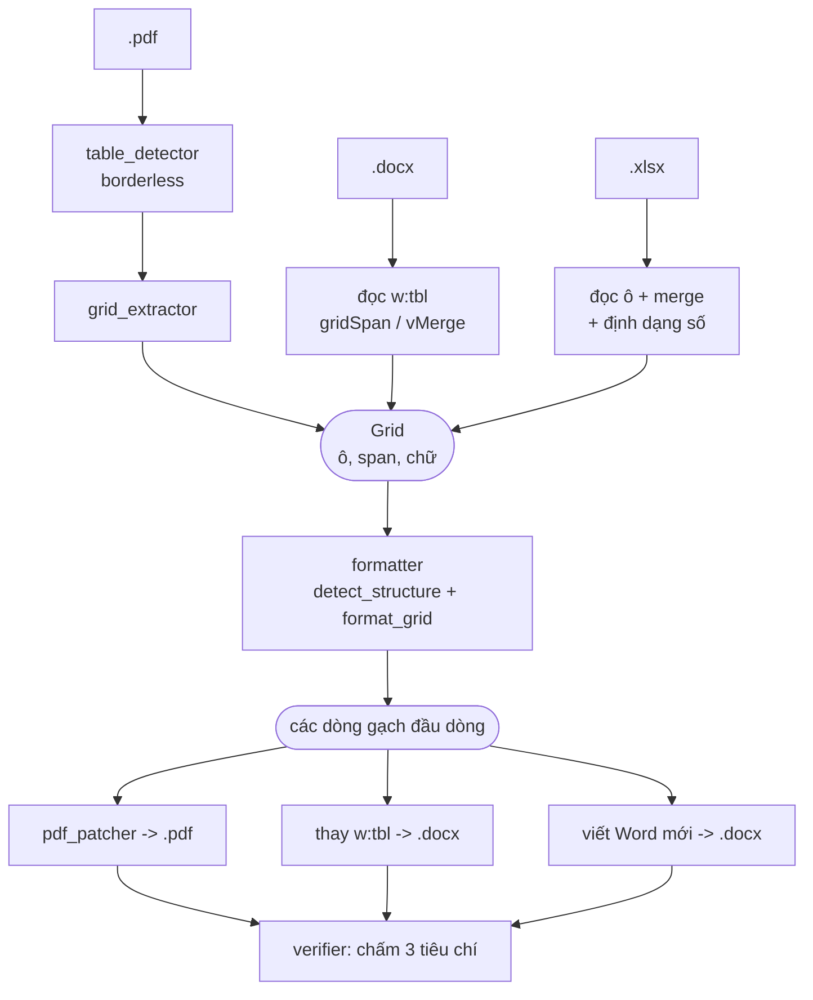

# PDF Table Flattener

Làm phẳng **mọi bảng** trong file PDF / Word / Excel thành gạch đầu dòng, vá
thẳng vào đúng vị trí bảng cũ và giữ nguyên định dạng của file gốc.

Mỗi bảng được đặt đúng vào hệ thống đánh số của chính tài liệu, nên một bảng dài
cắt thành chunk ở đâu thì chunk đó vẫn tự khai nó thuộc mục nào:

```
1. THUẬT NGỮ                        <- tiêu đề sẵn có trong tài liệu
  1.1 Tên  |  Tuổi  |  Chức vụ      <- bảng nằm dưới mục 1
      1.1.1 Tên: Nam  |  Tuổi: 25  |  Chức vụ: Dev
      1.1.2 Tên: Lan  |  Tuổi: 30  |  Chức vụ:
            1.1.2.1 Quản lý nhóm phát triển
            1.1.2.2 Phụ trách tuyển dụng
```

Người dùng cuối chỉ cần đọc [`HUONG_DAN.txt`](HUONG_DAN.txt). File này dành cho
người phát triển: nó mô tả dự án được ghép từ những gì và chạy ra sao.

| Đầu vào | Đầu ra | Vì sao |
| --- | --- | --- |
| `.pdf` | `.pdf` | vá tại chỗ, mọi thứ ngoài bảng giữ nguyên từng byte |
| `.docx` | `.docx` | thay phần tử bảng bằng các đoạn văn, ngay tại vị trí cũ |
| `.xlsx` / `.xlsm` | `.docx` | một danh sách gạch đầu dòng không còn là bảng tính |

---

## 1. Bản hợp đồng: 3 tiêu chí

Mọi quyết định thiết kế trong dự án đều quy về ba tiêu chí trong
[`test.md`](test.md). Đọc phần này trước, phần còn lại sẽ tự giải thích:

1. **Giữ nguyên nội dung ngoài bảng.** Văn bản, tiêu đề, hình ảnh, sơ đồ không
   được đụng tới.
2. **Làm phẳng hết bảng.** Toàn bộ nội dung trong bảng ra gạch đầu dòng, và
   trong file kết quả không còn bảng nào.
3. **Sạch sẽ.** Không ký tự lạ, không ký tự ẩn, không nhãn giả kiểu `Cột 1:`,
   không hai dòng trống liên tiếp.

Ứng dụng **tự chấm điểm chính nó** theo ba tiêu chí này sau mỗi lần chạy — xem
mục [Tự kiểm tra](#7-tự-kiểm-tra-verifierpy).

---

## 2. Chạy

| Hệ điều hành | Nháy đúp vào |
| --- | --- |
| Windows | `START_Windows.bat` |
| macOS | `START_macOS.command` |
| Linux | `START_Linux.sh` |

Lần đầu chạy sẽ tự tạo `.venv`, cài dependency và tải font Noto (cần Internet,
2–5 phút). Các lần sau chạy offline hoàn toàn.

Dòng lệnh:

```bash
python cli.py -i "duong/dan/file.pdf"
```

```bash
python cli.py -i "thu_muc" -o "thu_muc_ket_qua" -v
```

`-i` nhận cả file lẫn thư mục. `--no-verify` bỏ bước tự kiểm tra,
`--no-numbering` tắt đánh số phân cấp và quay lại gạch đầu dòng `-` như bản cũ,
`-v` in log chi tiết. Trong GUI, đánh số là một ô tick (mặc định bật).

---

## 3. Cấu trúc thư mục

```
START_Windows.bat / START_macOS.command / START_Linux.sh   trình khởi chạy
tools/
  bootstrap.py        cài đặt lần đầu, dùng chung cho cả 3 OS
  posix_launch.sh     phần thân launcher của macOS + Linux
  build_zip.py        tạo gói phân phối
gui.py                giao diện Tkinter (kéo-thả, xử lý hàng loạt)
launch_gui.py         cửa ngõ vào GUI, báo lỗi tử tế khi thiếu thư viện
cli.py                giao diện dòng lệnh
assets/fonts/         font Noto, tải về lần chạy đầu

src/pdf_table_tool/
  pipeline.py         nhạc trưởng: chọn đường xử lý theo đuôi file
  ── nhận diện bảng ──────────────────────────────────────────
  table_detector.py   tìm bảng trên trang PDF, loại bảng lồng, nối bảng qua trang
  borderless.py       tìm bảng không kẻ khung, dựa vào khe trắng giữa các cột
  ── đọc bảng thành dữ liệu ──────────────────────────────────
  grid_extractor.py   gán từng chữ vào đúng một ô -> Grid
  ── biến Grid thành gạch đầu dòng ───────────────────────────
  formatter.py        trái tim dùng chung của cả ba định dạng
  outline.py          đọc tiêu đề tài liệu, đánh số phân cấp cho từng bảng
  text_utils.py       chuẩn hoá chữ, tách token, nhận diện gạch đầu dòng
  ── ghi kết quả ─────────────────────────────────────────────
  pdf_patcher.py      vá bullet vào PDF mà không cắt chữ
  text_layout.py      xuống dòng theo đúng metric của font
  docx_flattener.py   đường xử lý Word
  docx_numbering.py   chạy lại bộ đếm danh sách của Word (số Word tự vẽ)
  xlsx_flattener.py   đường xử lý Excel
  ── phần còn lại ────────────────────────────────────────────
  verifier.py         tự chấm 3 tiêu chí trên chính đầu ra
  config.py           đường dẫn font + hằng số chữ nghĩa
  platform_support.py mọi khác biệt giữa Windows / macOS / Linux

tests/                177 test
```

---

## 4. Cách hoạt động

Ba định dạng đi ba đường khác nhau ở phần **đọc**, rồi nhập lại làm một ở phần
**hiểu và viết**. Đó là lý do một cái bảng giống nhau trong PDF, Word và Excel
cho ra gạch đầu dòng y hệt nhau.



### 4.1 Đường PDF — khó nhất

Một file PDF không hề lưu "đây là cái bảng". Nó chỉ lưu các nét mực và các chữ
nằm ở toạ độ nào. Cả đường xử lý này là việc dựng lại cái bảng từ hình học.

**Bước 1 — tìm bảng** (`table_detector.py`)

Dùng chiến lược `lines` của pdfplumber để bắt bảng có kẻ khung. Hai luật ở đây
quyết định tính đúng đắn:

- **Bảng lồng bị loại.** Word vẽ một danh sách gạch đầu dòng bên trong ô bằng
  chính nét kẻ của nó, nên pdfplumber báo về đó là một bảng thứ hai *nằm trong*
  bảng thật. Lấy nhầm bảng trong sẽ mất sạch chữ của bảng ngoài — đây từng là
  nguồn mất nội dung lớn nhất. Bảng con không bị vứt đi: `pipeline._flatten_nested`
  làm phẳng nó riêng rồi ghép ngược vào đúng ô cha.
- **Không bao giờ nới rộng khung bảng.** Nới lên trên để "bắt" dòng tiêu đề của
  trang sau sẽ nuốt luôn header trang, logo và chú thích — vi phạm tiêu chí 1.

`_link_multipage_tables` nhận ra bảng bị cắt qua nhiều trang bằng cách so lưới
cột, đánh dấu trang sau là `is_continuation` để nó thừa hưởng dòng tiêu đề của
trang trước.

**Bước 2 — bảng không kẻ khung** (`borderless.py`)

Chiến lược `text` sẵn có của pdfplumber coi mọi dòng trên trang là một hàng của
bảng, bật lên là văn xuôi bình thường biến thành bảng vô nghĩa. Module này thay
vào đó tìm đúng một thứ mà bảng không khung có còn văn xuôi thì không: **khe cột**
— một dải trắng dọc chạy liên tục qua nhiều dòng liền nhau.

Toàn bộ chỗ này cố tình dè dặt: bỏ sót một bảng không khung thì trang giữ nguyên,
vô hại; nhận nhầm thì băm nát một đoạn văn. Ví dụ mục lục ("Chương một .......... 12")
có hình dạng y hệt bảng hai cột, nên dòng có dấu chấm dẫn bị loại thẳng.

**Bước 3 — đọc thành `Grid`** (`grid_extractor.py`)

Không dùng `pdfplumber.Table.extract()`: nó chạy lại thuật toán dò ô của riêng
mình và sẵn sàng vứt chữ rơi giữa hai ô. Thay vào đó module này lấy **các hình
chữ nhật ô** pdfplumber đã tìm ra, rồi gán từng chữ nằm trong khung bảng vào
đúng một ô. Một chữ không thể biến mất: nếu nó không nằm trong ô nào, nó được
gắn vào ô gần nhất về mặt hình học.

**Bước 4 — vá ngược vào PDF** (`pdf_patcher.py` + `text_layout.py`)

- Trang không có bảng được **chép nguyên byte** — tiêu chí 1 khi đó đúng hiển nhiên.
- Trang có bảng chỉ bị bôi đen đúng hình chữ nhật của bảng. Không có gì khác
  trên trang bị vẽ lại.
- **Không bao giờ cắt chữ.** Nếu bullet không vừa chỗ vừa giải phóng: thu nhỏ
  font trước, rồi mượn khoảng trống bên dưới bảng, cuối cùng mới nối sang trang
  phụ chèn thêm. `Page.insert_textbox` của thư viện thì lặng lẽ cắt bớt — đó là
  cách cả đoạn văn từng biến mất ở bản cũ, nên `text_layout.py` tự đo và tự
  xuống dòng để lúc nào cũng biết chính xác đã vẽ được mấy dòng và còn thừa gì.

Cỡ chữ và kiểu chữ (có chân / không chân) của bullet được chọn theo chính chữ
trong bảng cũ, để chỗ vá không bị lạc lõng.

### 4.2 Đường Word (`docx_flattener.py`)

Dễ hơn hẳn: file `.docx` tự khai báo cấu trúc của nó. Module đọc thẳng
`w:gridSpan` / `w:vMerge` để biết ô gộp, `w:numPr` để biết cấp danh sách, rồi
dựng ra cùng một `Grid`. Word còn nói luôn dòng nào là tiêu đề (`w:tblHeader`),
nên phần đoán bằng hình học được bỏ qua.

Phần tử `w:tbl` sau đó bị thay bằng một đoạn văn cho mỗi dòng bullet, đúng vị
trí cũ trong tài liệu — nên tiêu đề, hình ảnh, bố cục section, header/footer
quanh nó không suy suyển.

### 4.3 Đường Excel (`xlsx_flattener.py`)

Dễ nhất trong ba: bảng tính **vốn đã là** lưới, không có bước nhận diện nào cả.
Việc thật sự chỉ có hai:

- Xác định chỗ một bảng kết thúc và bảng sau bắt đầu (`sheet_blocks`).
- Đổi giá trị lưu trữ về đúng cái người ta nhìn thấy trong Excel: `0.291` dưới
  định dạng phần trăm là `29.1%`, không phải `0.291`.

Workbook không có dạng "đã làm phẳng" của riêng nó — danh sách gạch đầu dòng
không phải lưới ô — nên kết quả ghi ra một file Word mới, mỗi sheet một tiêu đề.

Nếu file Excel có công thức mà Excel chưa tính sẵn, ô đó rỗng ngay trong file
gốc; ứng dụng cảnh báo thay vì âm thầm bỏ qua.

---

## 5. Trái tim dùng chung: `formatter.py`

Cả ba đường đều đổ về đây, và đây là chỗ quyết định bullet **đọc có xuôi không**.

**`detect_structure()` — bảng này nằm ngang hay nằm dọc?**

Trả lời hai câu hỏi: mấy dòng đầu là tiêu đề cột (`header_rows`), và cột đầu có
phải là nhãn của từng dòng không (`label_column`). Một bảng có thể có cả hai,
một trong hai, hoặc không có gì. Đoán sai chỗ này sinh ra thứ vô nghĩa kiểu ghép
mọi dòng với câu văn ở dòng đầu tiên.

Suy luận hoàn toàn từ hình học: ô ngắn hay dài, có gạch đầu dòng không, có toàn
số không, ô nào gộp mấy cột. Một dòng chỉ được coi là tiêu đề khi nó đặt tên cho
**từng** cột bên dưới — một câu dài trải ngang nhiều cột là dữ liệu.

**`format_grid()` — dựng dòng bullet**

Hàng có ô cuối dài nhiều đoạn thì tách thành một dòng tiêu đề cộng các bullet con
thụt vào, vì nhồi mấy đoạn văn lên một dòng vật lý thì không ai đọc nổi.

Bốn điều được bảo đảm ngay tại chỗ này:

- không bịa nhãn cột (`Cột 1:`, `Column 2:`);
- không lặp tiêu đề thành chính giá trị của nó (`Điều kiện: Điều kiện vay vốn`);
- không có dòng trống nào bên trong một khối bullet;
- **mọi token của `Grid` đều xuất hiện trong đầu ra** — `_completeness_guard`
  đếm và đối chiếu, đây là chốt chặn cuối cùng chống mất chữ.

---

## 6. Đánh số phân cấp cho RAG (`outline.py`)

Một bảng dài bị chunker cắt ở giữa sẽ sinh ra chunk mở đầu bằng một dòng trơ
trọi, không nói được nó thuộc mục nào của tài liệu. Module này gắn mỗi dòng vào
đúng nhánh của tài liệu, nên cắt ở đâu chunk vẫn còn đường dẫn về mục cha.

Số **không được bịa ra**: nó lấy từ hệ thống đánh số mà tài liệu vốn đã có.

**Đọc tiêu đề.** `parse_heading()` nhận `1.`, `1.1`, `2.3.2.`, `3)` và cả
`ĐIỀU 5:` — kiểu đánh số của văn bản pháp lý Việt Nam, trong đó `ĐIỀU 5` và các
khoản `5.1`, `5.2` là cùng một cây. Chỗ khó là loại những thứ *trông giống*:

| Không phải tiêu đề | Vì sao |
| --- | --- |
| `1.000.000 đồng` | nhóm sau dấu chấm bắt đầu bằng số 0 — đó là dấu phân cách hàng nghìn |
| `3 Bản sao là bản sao y chứng thực` | không có dấu chấm sau số: đây là chú thích chân trang |
| `2.1. Quyền lợi ......... 7` | có dấu chấm dẫn: dòng của mục lục, số thật nhưng vị trí không thật |
| `Điều 8.2 quy định về tạm ứng` | sau số là số, không phải tên mục — đây là câu dẫn chiếu |

Với PDF còn thêm hai tín hiệu: dòng phải **mở đầu một đoạn** (dòng trên nó không
chạy hết lề phải, hoặc cách xa hơn giãn dòng thường), **hoặc** số phải **nối tiếp**
tiêu đề trước đó (`1.13` ngay sau `1.12`). Chỉ một trong hai thì bỏ sót: văn bản
căn đều hai bên làm tín hiệu hình học câm, còn tín hiệu số thì im lặng khi tài
liệu nhảy số.

**Cấp số cho bảng.** Bảng nhận số con kế tiếp của mục đang mở: dưới `2.3.1` thì
bảng là `2.3.1.1`, dòng của nó là `2.3.1.1.1`. Mọi số mà tài liệu tự dùng ở bất
kỳ đâu (kể cả trong mục lục) đều được **giữ chỗ trước**, nên bảng không bao giờ
bị cấp trùng số với một tiêu đề thật ở phía dưới.

Tài liệu không đánh số mục thì các bảng lần lượt là `1.`, `2.`, … và dòng của
chúng là `1.1`, `1.2`.

**Bảng dài qua nhiều trang** giữ nguyên số của nó và đếm tiếp: trang sau bắt đầu
lại bằng dòng tên bảng kèm `(tiếp theo)` rồi chạy tiếp `3.1.7`, `3.1.8` — đúng
thứ một chunk cần để tự đứng được một mình.

**Word giấu số của chính nó** (`docx_numbering.py`). Văn bản hành chính hiếm khi
gõ số mục vào text: tác giả tick "danh sách đánh số", Word giữ bộ đếm trong
`numbering.xml` rồi vẽ "4." ra màn hình — đoạn văn tới tay ta chỉ còn
`Chính sách ưu đãi`. Module này chạy lại đúng bộ đếm đó (`w:numPr` trên đoạn văn
*hoặc* trên style, `w:abstractNum`, `w:startOverride` khi phụ lục đánh số lại từ
đầu) nên bảng nằm dưới mục Word hiển thị là "4." được đánh số `4.1`, không phải
một số tự nghĩ ra. Bộ đếm phải chạy qua **mọi** đoạn văn kể cả trong ô bảng,
đúng như Word đếm, nếu không mọi mục phía sau đều lệch một số.

Thứ tự ưu tiên khi đọc một đoạn văn Word: số viết thẳng trong text → số Word tự
vẽ → cấp của style `Heading N` (tự đếm, dùng khi không còn gì khác). Excel coi
mỗi sheet là một mục. Bảng lồng trong ô **không** được cấp số riêng — nó là nội
dung của dòng cha, không phải một mục.

Số sâu quá 6 cấp thì dòng giữ lại ký hiệu gạch đầu dòng, vì `1.2.3.4.5.6.1` không
còn giúp ai đọc nữa.

Tắt bằng `--no-numbering`, hoặc bỏ tick trong GUI.

---

## 7. Tự kiểm tra (`verifier.py`)

Chạy trên chính đầu ra sau mỗi lần xử lý, nên lỗi hồi quy hiện ra thành báo cáo
FAIL chứ không phải một file PDF hỏng âm thầm.

| Tiêu chí | Cách kiểm |
| --- | --- |
| 1 + 2 — không mất chữ | Đếm token đầu vào và đầu ra bằng `Counter` rồi so. Token có thể đổi hình dạng hợp lệ (nối lại chữ bị xuống dòng giữa từ: `Khoả` + `n` -> `Khoản`), nên chỉ tính là mất khi nó không còn tồn tại kể cả dưới dạng chuỗi con. |
| 2 — hết bảng | Mở lại file kết quả và dò bảng lần nữa; còn bảng nào đủ lớn là FAIL. |
| 3 — sạch sẽ | Tìm nhãn giả, ký tự lạ, hai dòng trống liên tiếp. Chỉ tính lỗi **do tool sinh ra**: lỗi có sẵn trong file gốc nằm ở phần giữ nguyên, mà tiêu chí 1 cấm đụng vào. |

Với `.docx` bản đếm token đọc thẳng XML của mọi phần (kể cả header, footer, text
box, hyperlink) nên không sót chỗ nào.

Tắt bằng `--no-verify` nếu cần chạy nhanh.

---

## 8. Không dùng AI

Toàn bộ việc làm phẳng là deterministic: cùng một file luôn cho ra cùng một kết
quả, không gọi mô hình ngôn ngữ nào, và không có byte nào của tài liệu rời khỏi
máy. Sau lần cài đầu tiên, ứng dụng chạy được khi máy ngắt hẳn Internet.

Cấu trúc bảng suy ra từ hình học của chính bảng đó, cộng phần khai báo tiêu đề
sẵn có của Word / Excel. Mọi chữ trong file kết quả đều lấy nguyên từ file gốc.

---

## 9. Khởi động trên cả ba hệ điều hành

Launcher chỉ có một việc: tìm ra Python 3.10+ có sẵn `tkinter`. Nếu máy không
có, nó tải `uv` từ astral.sh rồi để `uv` cài một bản Python riêng cho ứng dụng —
nên máy đích không cần cài sẵn gì cả.

Sau đó mọi thứ do `tools/bootstrap.py` lo, giống hệt nhau trên cả ba nền tảng:

1. tạo `.venv` cạnh ứng dụng nếu chưa có,
2. cài dependency đã ghim phiên bản,
3. tải font Noto hỗ trợ tiếng Việt (cố gắng hết sức, thiếu vẫn chạy được),
4. chạy lại đúng entry point bằng interpreter của `.venv`.

Bước 4 là lý do file đó chỉ được dùng standard library: nó chạy dưới Python
**hệ thống**, trước khi có bất kỳ dependency nào. Cũng vì thế công việc được gác
bằng một file dấu — lần chạy thứ hai trở đi vào thẳng ứng dụng và không cần mạng.

Khác biệt thật sự giữa các OS gom hết vào `platform_support.py`: mở thư mục kết
quả, chọn font giao diện, và chuyển thư mục kết quả sang `Documents` khi thư mục
ứng dụng không ghi được (bản giải nén vào `Program Files` hay `/Applications`
không ghi được, nếu không xử lý sẽ hỏng ở đúng bước cuối).

---

## 10. Đóng gói để gửi người khác

```bash
python tools/build_zip.py
```

Sinh ra `dist/PDF-Table-Flattener-<version>.zip`. Gửi file đó đi; người nhận
giải nén rồi nháy đúp file START tương ứng.

Script giữ lại quyền thực thi cho `.sh` / `.command` — thiếu bit này macOS từ
chối chạy launcher — và loại `.venv`, cache, tài liệu thử nghiệm cùng các ghi
chú thiết kế ra khỏi gói.

---

## 11. Phát triển

```bash
python tools/bootstrap.py --mode setup     # chỉ cài môi trường
```

```bash
python tools/bootstrap.py --mode test      # chạy pytest
```

```bash
python tools/bootstrap.py --mode cli -- -i "file.pdf" -v
```

```bash
python tools/bootstrap.py --force ...      # cài lại từ đầu
```

Bộ test có 177 case, phần lớn dựng PDF/Word/Excel ngay trong test rồi kiểm tra
đầu ra, nên chạy được mà không cần tài liệu thật:

| File | Kiểm cái gì |
| --- | --- |
| `test_flattener.py` | luồng PDF đầu-cuối |
| `test_generality.py` | không bám vào file mẫu cụ thể nào |
| `test_nested.py` | bảng lồng trong bảng |
| `test_overflow.py` | bullet dài hơn chỗ trống, tràn sang trang phụ |
| `test_docx.py` / `test_xlsx.py` | hai đường Word và Excel |
| `test_numbering.py` | đọc tiêu đề, cấp số cho bảng, đánh số dòng ở cả ba định dạng |
| `test_units.py` | các hàm nhỏ trong `text_utils`, `formatter`, `text_layout` |
