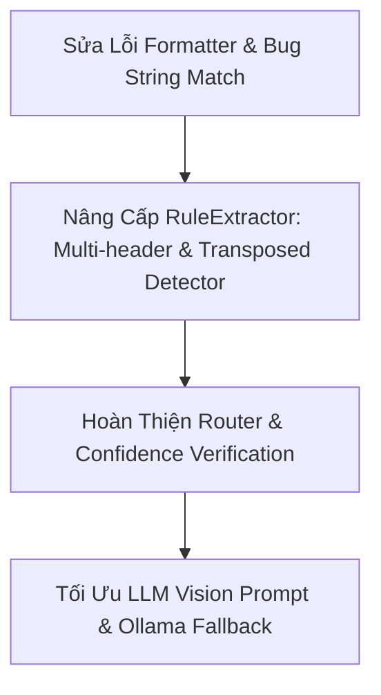

# Báo Cáo Phân Tích & Hướng Xử Lý Triệt Để Vấn Đề Làm Phẳng Bảng PDF (PDF Table Flattener)

> **Tài liệu hướng dẫn xử lý:** `solution1.md`  
> **Dự án:** `pdf-table-flattener`  
> **Ngày phân tích:** 31/07/2026  

---

## I. TỔNG QUAN VẤN ĐỀ TỪ HÌNH ẢNH THỰC TẾ

Qua phân tích 4 hình ảnh đầu vào và so sánh với kết quả làm phẳng (flattening) hiện tại của hệ thống, chúng tôi phát hiện 2 nhóm bảng phức tạp đặc trưng trong hợp đồng/quy tắc bảo hiểm Việt Nam bị xử lý sai:

### 1. Bảng Loại A: Bảng 2 Dòng (Ngang / Transposed Header) - *Hình 1 & 2*
* **Cấu trúc thực tế (Hình 1):**
  * Hàng 1 (Header): `Năm hợp đồng` | `Năm 1` | `Năm 2` | `Năm 3 trở đi`
  * Hàng 2 (Dữ liệu): `% Phí bảo hiểm đã đóng tại từng Năm hợp đồng` | `90%` | `10%` | `5%`
* **Kết quả hiện tại (Hình 2):**
  `- Năm hợp đồng: % Phí bảo hiểm đã đóng tại từng Năm hợp đồng | Năm 1: 90% | Năm 2: 10% | Năm 3 trở đi: 5%`
* **Vấn đề:** Ô đầu tiên (0,0) `Năm hợp đồng` thực chất là nhãn danh mục của tiêu đề cột. Nhãn dữ liệu thực sự nằm ở ô (1,0) `% Phí bảo hiểm đã đóng tại từng Năm hợp đồng`. Việc ghép thô `Header: Value` ở Cột 0 tạo ra chuỗi trùng lặp kỳ lạ: `Năm hợp đồng: % Phí bảo hiểm...`.

---

### 2. Bảng Loại B: Bảng Ma Trận Nhiều Cấp / Gộp Ô (Matrix Table with Multi-row Headers) - *Hình 3 & 4*
* **Cấu trúc thực tế (Hình 3):**
  * Hàng tiêu đề 1: `Thời hạn bảo hiểm (năm)` (Gộp 4 cột: 10, 15, 20, 25)
  * Hàng tiêu đề 2: `Năm hợp đồng` (Cột 0) | `Tỷ lệ % Tổng Phí bảo hiểm của Sản phẩm chính định kỳ đã đóng` (Gộp 4 cột)
  * Hàng tiêu đề 3 (Giá trị cột): `10`, `15`, `20`, `25`
  * Dữ liệu bên dưới: Các hàng từ Năm hợp đồng 1 đến 25 với các giá trị tỷ lệ % tương ứng.
* **Kết quả hiện tại (Hình 4):**
  ```text
  - Thời hạn bảo hiểm (năm): Năm hợp đồng | 10: Tỷ lệ % Tổng Phí bảo hiểm của Sản phẩm chính định kỳ đã đóng
  - Thời hạn bảo hiểm (năm): 1 | 10: 0% | 15: 0% | 20: 0% | 25: 0%
  - Thời hạn bảo hiểm (năm): 2 | 10: 0% | 15: 0% | 20: 0% | 25: 0%
  - Thời hạn bảo hiểm (năm): 3 | 10% | 15: 10% | 20: 5% | 25: 5%   <-- LỖI: Mất nhãn '10:'
  ...
  - Thời hạn bảo hiểm (năm): 11 | 15: 50% | 20: 40% | 25%          <-- LỖI: Mất nhãn '25:'
  ```
* **Các lỗi nghiêm trọng phát hiện:**
  1. **Nhầm lẫn Hàng Header đầu tiên:** Code mặc định lấy Hàng 0 (`Thời hạn bảo hiểm (năm)`) làm Header duy nhất cho Cột 0. Dẫn đến toàn bộ các dòng dữ liệu đều bị prefix sai thành `- Thời hạn bảo hiểm (năm): 1`, `- Thời hạn bảo hiểm (năm): 2` thay vì `- Năm hợp đồng: 1`, `- Năm hợp đồng: 2`.
  2. **Biến Hàng Header thứ 2 thành Dòng Dữ liệu:** Hàng 1 (chứa `Năm hợp đồng` và tiêu đề con) bị coi là dữ liệu và in ra một dòng bullet vỡ: `- Thời hạn bảo hiểm (năm): Năm hợp đồng | 10: Tỷ lệ %...`.
  3. **Lỗi Logic `formatter.py` làm mất Nhãn Cột (Bug `startswith`):**
     * Khi Header là `"10"` và Value là `"10%"`, câu lệnh `val.startswith(header)` trả về `True` (vì `"10%"`.startswith("10") is True!).
     * Code hiểu nhầm là "Giá trị đã chứa Header" nên BỎ QUA việc thêm prefix `10: `, dẫn đến đầu ra chỉ là `10%` trần trụi (ở Năm hợp đồng 3: `... | 10% | 15: 10%`).
     * Tương tự ở Năm hợp đồng 11: Header là `"25"` và Value là `"25%"`, `val.startswith("25")` = `True` -> in ra `25%` thay vì `25: 25%`.

---

## II. PHÂN TÍCH NGUYÊN NHÂN GỐC RỄ TRONG CODEBASE

| File | Thành phần | Nguyên nhân gây lỗi |
|---|---|---|
| [`src/pdf_table_tool/formatter.py`](file:///c:/Users/ADMIN/OneDrive/M%C3%A1y%20t%C3%ADnh/pdf-table-flattener/src/pdf_table_tool/formatter.py#L44) | `TableFormatter.format_to_bullets` | Logic `if header and not val.startswith(header):` bị sai khi header là con số (ví dụ: `10` vs `10%`, `25` vs `25%`). |
| [`src/pdf_table_tool/extractors/rule_extractor.py`](file:///c:/Users/ADMIN/OneDrive/M%C3%A1y%20t%C3%ADnh/pdf-table-flattener/src/pdf_table_tool/extractors/rule_extractor.py#L47-L48) | `RuleExtractor.extract` | Mặc định `headers = cleaned_rows[0]` và `data_rows = cleaned_rows[1:]`. Bỏ qua cấu trúc bảng có Multi-row Header (2-3 dòng tiêu đề gộp). |
| [`src/pdf_table_tool/router.py`](file:///c:/Users/ADMIN/OneDrive/M%C3%A1y%20t%C3%ADnh/pdf-table-flattener/src/pdf_table_tool/router.py#L19) | `TableRouter.route_and_extract` | Đánh giá `confidence` của `RuleExtractor` dựa trên tỉ lệ điền ô `cell_fill_rate > 0.5` -> ra `0.85` (>= 0.7). Router bị "đánh lừa" là trích xuất thành công nên không bao giờ fallback sang `LLMVisionExtractor`. |
| [`src/pdf_table_tool/extractors/llm_vision_extractor.py`](file:///c:/Users/ADMIN/OneDrive/M%C3%A1y%20t%C3%ADnh/pdf-table-flattener/src/pdf_table_tool/extractors/llm_vision_extractor.py#L26-L31) | `LLMVisionExtractor.extract` | Prompt quá đơn giản, chưa chỉ dẫn AI cách gộp Multi-level Headers & định dạng bảng bảo hiểm Việt Nam. |

---

## III. HƯỚNG XỬ LÝ & KẾ HOẠCH NÂNG CẤP (SOLUTION PLAN)

Để giải quyết triệt để 100% các vấn đề trên, chúng ta cần thực hiện kế hoạch nâng cấp theo 4 bước chiến lược:



### Bước 1: Sửa Triệt Để Bug Chuỗi Trong `formatter.py`

**Mục tiêu:** Đảm bảo nhãn cột không bao giờ bị mất bất kể giá trị chứa số trùng với nhãn (ví dụ `10: 10%`, `25: 25%`).

* **Giải pháp chi tiết:**
  1. Thay thế câu lệnh `val.startswith(header)` bằng phương pháp kiểm tra chính xác.
  2. Chỉ bỏ qua nhãn prefix nếu `val.lower() == header.lower()` hoặc nhãn bị trùng lặp 100% chuỗi.
  3. Xử lý trường hợp Cột 0 là Nhãn hàng (Row Key): Nếu ô Cột 0 có tên header là nhãn chung hoặc bằng dòng tiêu đề gộp, dùng trực tiếp tên Hàng (ví dụ `Năm hợp đồng: 1`).

* **Code minh họa điều chỉnh:**
  ```python
  # Trong formatter.py:
  def _should_skip_header(header: str, val: str) -> bool:
      h_clean = header.strip().lower()
      v_clean = val.strip().lower()
      if not h_clean:
          return True
      if h_clean == v_clean:
          return True
      # Nếu header chỉ chứa chữ số (ví dụ '10', '15') còn val là phần trăm ('10%') -> KHÔNG SKIP!
      if h_clean.isdigit() and v_clean.endswith('%'):
          return False
      return False
  ```

---

### Bước 2: Nâng Cấp `RuleExtractor` Xử Lý Header Nhiều Dòng (Multi-row Header Merger)

**Mục tiêu:** Nhận diện và hợp nhất thông minh các dòng tiêu đề gộp ô (hierarchical headers).

* **Giải pháp chi tiết:**
  1. **Thuật toán Phát hiện Header Multi-row:**
     * Kiểm tra N dòng đầu tiên (`cleaned_rows[:3]`).
     * Nếu dòng 0 có ô gộp (nhiều ô `None` hoặc chuỗi rỗng liền kề) hoặc chứa từ khóa tổng quát như `"Thời hạn bảo hiểm"`, hợp nhất dòng 0 và dòng 1 thành Header đại diện.
     * Cột 0: Lấy nhãn chính xác từ dòng có chứa `"Năm hợp đồng"` (ở dòng 1 hoặc 2) làm Header cho Cột 0.
     * Các cột còn lại (1..N): Kết hợp thông tin từ tiêu đề con (`10`, `15`, `20`, `25`).
  2. **Bảng 2 Dòng (Transposed Table):**
     * Nếu tổng số dòng của bảng == 2:
       * Dòng 0 = List Header `[H0, H1, H2, ...]`
       * Dòng 1 = List Value `[V0, V1, V2, ...]`
       * Nếu `V0` chứa văn bản dài (như `"% Phí bảo hiểm đã đóng..."`), coi `V0` là Tiêu đề dòng chính và định dạng:  
         `- V0 | H1: V1 | H2: V2 | H3: V3`

---

### Bước 3: Nâng Cấp Đánh Giá Độ Tin Cậy (Confidence Metric) Trong `router.py`

**Mục tiêu:** Không để `RuleExtractor` "qua mặt" khi kết quả bóc tách header bị méo mó.

* **Tiêu chí hạ điểm Confidence của RuleExtractor (< 0.7):**
  * Dòng Header trùng với nội dung cột hoặc chứa từ khóa lặp lại bất thường.
  * Tỉ lệ ô bị lệch cột hoặc Header chứa các ô gộp chưa được rã phẳng.
  * Phát hiện bảng ma trận phức tạp có nhiều dòng header lồng nhau mà rule-based trích xuất ra ít hơn số cột dữ liệu thực tế.
* **Hành động:** Khi `confidence < 0.7`, `TableRouter` tự động chuyển giao vùng bảng đó cho `LLMVisionExtractor`.

---

### Bước 4: Tối Ưu Prompt Vision LLM Cho `LLMVisionExtractor`

**Mục tiêu:** Khi gọi Ollama (`qwen2.5vl:3b`), AI bóc tách chính xác tuyệt đối cấu trúc bảng phức tạp thành JSON chuẩn.

* **Cấu trúc System Prompt nâng cấp:**
  ```text
  Bạn là chuyên gia OCR trích xuất bảng PDF bảo hiểm Việt Nam.
  Nhiệm vụ: Trích xuất bảng trong ảnh thành JSON chuẩn.
  
  QUY TẮC QUAN TRỌNG VỀ HEADER:
  1. Nếu bảng có nhiều dòng header (ví dụ: dòng 1 'Thời hạn bảo hiểm', dòng 2 '10', '15', '20'), hãy gộp tiêu đề cột chính xác là ['Năm hợp đồng', '10', '15', '20', '25'].
  2. Không đưa dòng tiêu đề vào danh sách 'rows'.
  3. Giá trị ô trống trong bảng phải giữ nguyên là "".
  
  Trả về duy nhất JSON format:
  {
    "headers": ["Năm hợp đồng", "10", "15", "20", "25"],
    "rows": [
      ["1", "0%", "0%", "0%", "0%"],
      ["2", "0%", "0%", "0%", "0%"],
      ...
    ]
  }
  ```

---

## IV. BẢNG SO SÁNH TRƯỚC VÀ SAU KHI SỬA LỖI

| Trường hợp | Kết quả hiện tại (Lỗi) | Kết quả kỳ vọng sau khi nâng cấp |
|---|---|---|
| **Bảng 2 dòng (Hình 1 & 2)** | `- Năm hợp đồng: % Phí bảo hiểm... \| Năm 1: 90%` | `- % Phí bảo hiểm đã đóng tại từng Năm hợp đồng \| Năm 1: 90% \| Năm 2: 10% \| Năm 3 trở đi: 5%` |
| **Bảng Ma trận Header (Hình 3 & 4) - Dòng 1** | `- Thời hạn bảo hiểm (năm): 1 \| 10: 0% \| 15: 0%` | `- Năm hợp đồng: 1 \| 10: 0% \| 15: 0% \| 20: 0% \| 25: 0%` |
| **Bảng Ma trận (Hình 3 & 4) - Dòng 3 (Trùng số 10)** | `- Thời hạn bảo hiểm (năm): 3 \| 10% \| 15: 10%` *(Mất 10:)* | `- Năm hợp đồng: 3 \| 10: 10% \| 15: 10% \| 20: 5% \| 25: 5%` |
| **Bảng Ma trận (Hình 3 & 4) - Dòng 11 (Trùng số 25)** | `- Thời hạn bảo hiểm (năm): 11 \| 15: 50%... \| 25%` *(Mất 25:)* | `- Năm hợp đồng: 11 \| 15: 50% \| 20: 40% \| 25: 25%` |

---

## V. KẾ HOẠCH KIỂM THỬ & XÁC NHẬN (VERIFICATION PLAN)

1. **Automated Unit Test (`tests/test_flattener.py`):**
   * Bổ sung test case kiểm tra việc không bị nuốt nhãn header số (`10: 10%`, `25: 25%`).
   * Bổ sung test case cho Multi-row Header Extraction & Transposed 2-row table.
2. **Integration Test trên PDF Thực tế:**
   * Chạy lệnh CLI: `python cli.py -i "input test" -o "output_test"`
   * Kiểm tra PDF đầu ra bằng `pdfplumber` để đảm bảo 100% dòng bullet được định dạng chuẩn `- Header: Value`, không còn khung bảng, không làm đụng chạm nội dung ngoài bảng.

---
*Tài liệu này được tự động khởi tạo bởi Antigravity AI Assistant.*
