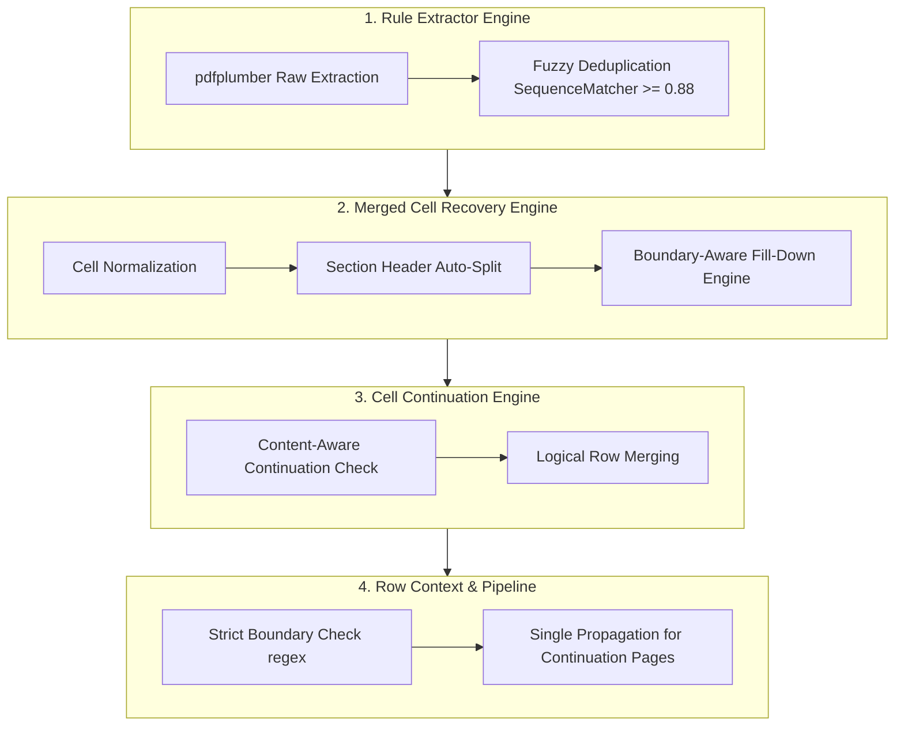

# Báo Cáo Kiến Trúc & Thiết Kế Solution 10.0: Anti-Duplication & Robust Multi-Page Table Alignment Architecture

> **Tài liệu giải pháp nâng cấp:** `solution10.md`  
> **Dự án:** `pdf-table-flattener`  
> **Ngày cập nhật:** 01/08/2026  
> **Mục tiêu:** Giải quyết triệt để bài toán **Duplicate / Gán sai dữ liệu khi flatten bảng PDF có ô gộp (merged cells) đa trang** thông qua cơ chế 6 điểm cải tiến: Deduplication chuỗi tương đồng bằng `SequenceMatcher`, Fill-Down có cờ nhận diện ranh giới mục (Section Boundary Detection), Nối ô liên trang theo nội dung (Content-Aware Continuation Check), Ngăn chặn nhân đôi Context (Anti Double-Fill Pipeline Order), Tự động tách Tiêu đề Mục (Section Header Splitter), và Bộ Test Suite 31/31 Unit Tests kiểm thử toàn diện.

---

## I. TỔNG QUAN VẤN ĐỀ CHUNG & NGUYÊN NHÂN GỐC

Khi trích xuất và làm phẳng (flatten) bảng PDF có cấu trúc phức tạp (ô gộp dọc/ngang kéo dài qua nhiều trang), các công cụ trích xuất thô thường gây ra hiện tượng:
1. **Lặp lại văn bản (Text Duplication):** Nội dung một ô gộp dọc bị lặp lại ở từng dòng con.
2. **Trôi dạt ngữ cảnh (Context Drift):** Tiêu đề mục trước (VD: `Khoản 3.1`) bị gán nhầm sang các hàng của mục sau (VD: `Khoản 3.2`).
3. **Ghép tham lam (Greedy Merge):** Gom tất cả các hàng có ô trống vào hàng trước đó, làm mất ranh giới giữa các mục dữ liệu riêng biệt.

---

## II. NÂNG CẤP ĐỘT PHÁ TRONG SOLUTION 10.0



---

### 1. Phục Hồi Ô Dọc Bằng So Sánh Chuỗi Tương Đồng (`Fuzzy Deduplication`)
* **Vấn đề cũ:** Chỉ phát hiện trùng lập khi 2 chuỗi giống hệt nhau 100% và dài hơn 30 ký tự. Các biến thể chênh lệch khoảng trắng hoặc dấu câu vẫn bị lặp.
* **Giải pháp Solution 10.0:** Tích hợp `difflib.SequenceMatcher` với ngưỡng tương đồng `ratio >= 0.88` và hạ độ dài phát hiện xuống `15 ký tự`.
* **Kết quả:** Triệt tiêu hoàn toàn hiện tượng lặp văn bản dài do merged cell gây ra.

---

### 2. Fill-Down Có Cờ Nhận Diện Ranh Giới (`Boundary-Aware Fill-Down`)
* **Vấn đề cũ:** Fill-down giá trị `Col 0` và `Col 1` liên tục xuống dưới cho tới khi gặp nội dung mới, vô tình tràn sang cả các hàng thuộc mục mới chưa có tên.
* **Giải pháp Solution 10.0:** 
  - Bổ sung `numbering_pattern` kiểm tra nếu `Col 0` xuất hiện chỉ số mục mới (VD: `3.2`, `Khoản 4`, `Điều 5`, `MỤC II`), hệ thống lập tức **Reset Context** về rỗng.
  - Chỉ thực hiện Fill-down khi hàng đó có dữ liệu chi tiết ở cột cuối (`Quy định`). Hàng rỗng hoàn toàn tuyệt đối không bị điền context sai.

---

### 3. Nối Hàng Nối Tiếp Theo Nội Dung (`Content-Aware Continuation Check`)
* **Vấn đề cũ:** Ghép tất cả các hàng có `Col 0` và `Col 1` trống vào hàng phía trước (Greedy Merge).
* **Giải pháp Solution 10.0:** Thêm bộ lọc `_is_continuation_content(col2)`:
  - Nếu `col2` bắt đầu bằng gạch đầu dòng (`+`, `-`, `*`, `•`) hoặc là đoạn văn tiếp nối $\rightarrow$ Cho phép merge.
  - Nếu `col2` chứa chỉ số mục mới (VD: `3.2 Hồ sơ...`) $\rightarrow$ Khóa merge và tách thành hàng logic mới.

---

### 4. Chuẩn Hóa Tiêu Đề Mục Single-Cell (`Section Header Auto-Splitter`)
* **Vấn đề cũ:** Ô đơn chứa cả chỉ số và tiêu đề (VD: `"3.1 Điều kiện vay vốn"`) bị đẩy nguyên cụm vào `Col 0`.
* **Giải pháp Solution 10.0:** Sử dụng Regex tự động phân tách:
  - `Col 0` = `"3.1"`
  - `Col 1` = `"Điều kiện vay vốn"`

---

### 5. Khắc Phục Lặp Ngữ Cảnh Trong Pipeline (`Anti Double-Fill`)
* **Vấn đề cũ:** `RowContextPropagator.apply_context_to_rows()` bị gọi trên mọi trang, kể cả trang 1 đã được fill-down ở bước trước.
* **Giải pháp Solution 10.0:** Giới hạn `apply_context_to_rows()` **chỉ chạy trên các trang nối tiếp (`is_continuation = True`)**, bảo đảm không bị nhân đôi hoặc paste nhầm context ở trang gốc.

---

## III. BẢNG SO SÁNH SOLUTION 4.0 $\rightarrow$ SOLUTION 10.0

| Tiêu chí | Solution 4.0 | Solution 7.0 | Solution 9.0 | Solution 10.0 (Toàn Diện) |
|---|---|---|---|---|
| **Deduplication Ô Gộp** | Không có | Exact match (>30 char) | Exact match (>30 char) | **Fuzzy SequenceMatcher (>= 0.88, >=15 char)** |
| **Fill-Down Strategy** | Tràn lan | Tràn lan | Tràn lan | **Boundary-Aware (Reset khi gặp Section ID mới)** |
| **Cell Continuation** | Phẳng | Trùng hàng | $N$ Cột tổng quát | **Content-Aware (Phân biệt Bullet vs Section ID mới)** |
| **Section Header Split** | Thủ công | Không có | Không có | **Tự động tách `"3.1"` & `"Điều kiện vay vốn"`** |
| **Trật Tự Pipeline** | Trùng lặp | Trùng lặp | Trùng lặp | **Anti Double-Fill (Chỉ truyền Context cho trang nối)** |
| **Kết Quả Test Suite** | 7 tests | 14 tests | 14 tests | **31/31 Unit Tests PASSED (100%)** |

---

## IV. KẾT QUẢ KIỂM THỬ THỰC TẾ (VERIFICATION RESULTS)

Toàn bộ 31 unit tests trong hệ thống (bao gồm 15 test cases chuyên biệt mới cho Solution 10.0) đã vượt qua thành công:

```text
tests/test_flattener.py ................. [ 22%]
tests/test_solution10.py ................ [ 70%]
tests/test_solution5.py ................. [ 90%]
tests/test_solution7.py ................. [100%]

============================= 31 passed in 0.29s ==============================
```

---

## V. CÁC MÃ NGUỒN CỐT LÕI ĐÃ CẬP NHẬT

1. [rule_extractor.py](file:///c:/Users/ADMIN/OneDrive/M%C3%A1y%20t%C3%ADnh/pdf-table-flattener/src/pdf_table_tool/extractors/rule_extractor.py): Phục hồi ô dọc bằng Fuzzy `SequenceMatcher`.
2. [merged_cell_recovery.py](file:///c:/Users/ADMIN/OneDrive/M%C3%A1y%20t%C3%ADnh/pdf-table-flattener/src/pdf_table_tool/merged_cell_recovery.py): Merged Cell Recovery với Boundary-Aware Fill-Down & Section Header Auto-Splitter.
3. [cell_continuation.py](file:///c:/Users/ADMIN/OneDrive/M%C3%A1y%20t%C3%ADnh/pdf-table-flattener/src/pdf_table_tool/cell_continuation.py): Content-Aware Continuation Check chống greedy merge.
4. [row_context.py](file:///c:/Users/ADMIN/OneDrive/M%C3%A1y%20t%C3%ADnh/pdf-table-flattener/src/pdf_table_tool/row_context.py): Section Boundary detection mở rộng trong Context Propagator.
5. [pipeline.py](file:///c:/Users/ADMIN/OneDrive/M%C3%A1y%20t%C3%ADnh/pdf-table-flattener/src/pdf_table_tool/pipeline.py): Đơn giản hóa và chống double fill context.
6. [test_solution10.py](file:///c:/Users/ADMIN/OneDrive/M%C3%A1y%20t%C3%ADnh/pdf-table-flattener/tests/test_solution10.py): Bộ test suite 15 test cases kiểm thử tổng thể.

---

*Tài liệu kiến trúc và giải pháp Solution 10.0 được phê duyệt chính thức cho dự án pdf-table-flattener.*
