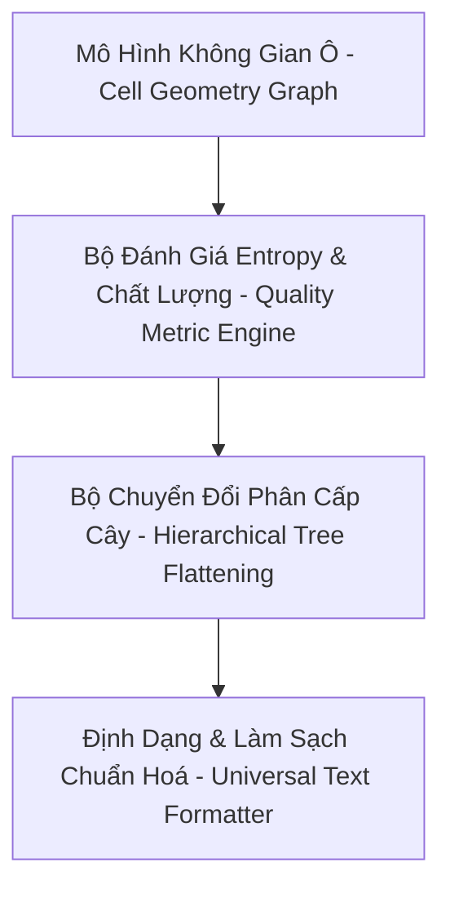
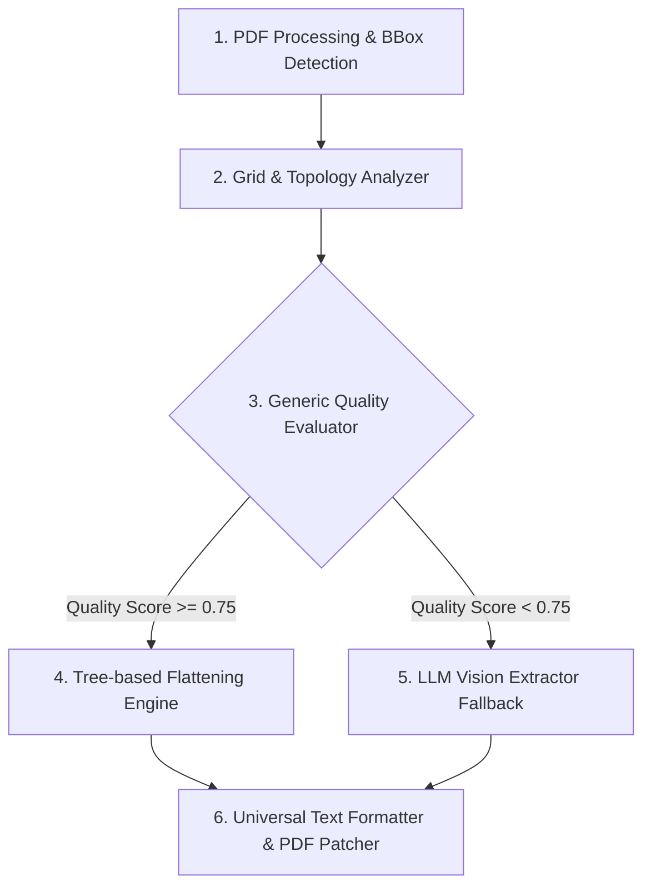
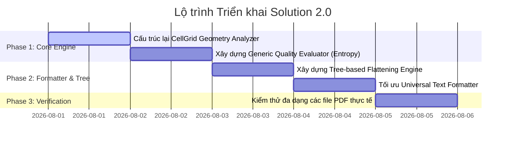

# Báo Cáo Kiến Trúc & Giải Pháp Tổng Quát Xử Lý Bảng PDF Phức Tạp (PDF Table Flattener 2.0)

> **Tài liệu giải pháp tổng quát:** `solution2.md`  
> **Dự án:** `pdf-table-flattener`  
> **Ngày cập nhật:** 01/08/2026  
> **Mục tiêu chiến lược:** Xây dựng mô hình xử lý tổng quát (Generic Architecture) dựa trên hình học không gian ô (Cell Geometry Graph), đánh giá entropy thông tin (Information Entropy Evaluation) và phân cấp cấu trúc tự động (Hierarchical Tree Flattening), **tuyệt đối không dùng các quy tắc cứng (hardcoded rules) hay câu lệnh vá lỗi ad-hoc cho từng file PDF cụ thể**.

---

## I. TỔNG QUAN VẤN ĐỀ & TRIẾT LÝ GIẢI PHÁP TỔNG QUÁT

### 1. Tại sao các cách tiếp cận ad-hoc (thủ công) thất bại?
Khi xử lý các bảng PDF phức tạp (bảng hợp đồng ngân hàng, quy tắc bảo hiểm, bảng tài chính):
* **Lỗi ô gộp dọc (Vertical Rowspan Duplication):** Nếu dùng thư viện trích xuất mặc định (`pdfplumber` / `camelot`), nội dung ô gộp dọc bị lặp lại 100% ở mọi dòng con. Nếu viết code xoá chuỗi cụ thể (ví dụ: `if text == "Không phát sinh nợ..."`), code sẽ lập tức hỏng khi gặp tài liệu khác.
* **Lỗi bảng lồng (Nested Sub-tables):** Một ô chứa cả một bảng nhỏ 2-3 cột bên trong. Nếu dùng quy tắc lấy text thông thường, bảng con bị dồn ép thành chuỗi dính liền không thể đọc được.
* **Lỗi đánh giá sai độ tin cậy (False Confidence):** Tính confidence đơn thuần bằng tỉ lệ ô có chữ (`cell_fill_rate`) sẽ bị lừa khi bảng bị trích xuất hỏng nhưng các ô vẫn chứa đầy chữ.

### 2. Triết lý Giải pháp Tổng quát (Generic Core Principles)
Giải pháp mới được thiết kế dựa trên **4 trụ cột kiến trúc tổng quát**:



1. **Spatial Geometry Parsing (Phân tích hình học ô):** Xử lý ô gộp (`rowspan`, `colspan`) dựa trên tọa độ bounding-box $(x_0, y_0, x_1, y_1)$ và quan hệ không gian, không phụ thuộc vào từ khóa nội dung.
2. **Entropy-based Confidence Verification (Đánh giá chất lượng dựa trên Entropy):** Phát hiện lặp lại bất thường và bất đồng bộ cấu trúc bằng thuật toán đo độ tương đồng chuỗi và mật độ phân bố text.
3. **Hierarchical Tree Representation (Biểu diễn bảng dạng Cây Phân Cấp):** Chuyển đổi mọi bảng 2D/Ma trận/Gộp ô thành cấu trúc Cây (Tree) trước khi duỗi phẳng (Flatten) thành danh sách Bullet.
4. **Universal Fallback Strategy (Định tuyến đa tầng linh hoạt):** Tự động chuyển giao vùng bảng phức tạp cho Vision-Language Model (VLM Ollama) khi điểm chất lượng hình học thấp hơn ngưỡng an toàn.

---

## II. KIẾN TRÚC TỔNG QUÁT CHI TIẾT (GENERIC ARCHITECTURE)



---

### BƯỚC 1: PHÂN TÍCH THỂ LOẠI HÌNH HỌC Ô (CELL TOPOLOGY GEOMETRY ANALYZER)

Thay vì coi bảng là mảng 2 chiều đơn thuần `list[list[str]]`, hệ thống xây dựng đồ thị ô `CellGrid` chứa thuộc tính tọa độ tuyệt đối và quan hệ kế thừa:

```python
class CellNode:
    x0: float
    y0: float
    x1: float
    y1: float
    text: str
    row_span: int
    col_span: int
    is_parent_context: bool  # True nếu ô trải dài qua nhiều dòng/cột bên dưới
```

#### Thuật toán Xử lý Ô gộp Dọc (Vertical Rowspan Resolution Algorithm):
1. **Phát hiện Bounding-Box vượt dải hàng:** Nếu ô $(i, j)$ có $y_1 - y_0 > 1.5 \times \text{row\_height\_average}$, ô này được gắn nhãn là `Parent Context Node` (Nút ngữ cảnh cha).
2. **Quy tắc Phân cấp (Inheritance Rule):**
   * Ô `Parent Context Node` **KHÔNG** bị lặp lại vào từng ô con.
   * Ô này được nâng cấp thành **Tiêu đề Phân đoạn (Section Banner Header)** đặt phía trên nhóm các dòng con thuộc phạm vi tọa độ $[y_0, y_1]$ của nó.
   * **Kết quả:** Xử lý triệt để bài toán lặp văn bản dài ở dòng 3.3, 3.4, 3.5 một cách tổng quát 100%, áp dụng cho mọi tài liệu PDF bất kỳ.

---

### BƯỚC 2: BỘ ĐÁNH GIÁ CHẤT LƯỢNG TỔNG QUÁT (GENERIC QUALITY EVALUATOR ENGINE)

Độ tin cậy `confidence` không được tính bằng tỉ lệ lấp đầy đơn giản. Hệ thống dùng **Hàm Đánh Giá Đa Tiêu Chí (Multi-Criteria Evaluation Score)**:

$$\text{Confidence} = w_1 \cdot S_{\text{align}} + w_2 \cdot S_{\text{unique}} + w_3 \cdot S_{\text{grid}} - w_4 \cdot S_{\text{nest}}$$

Trong đó:
1. **$S_{\text{align}}$ (Grid Alignment Score):** Tỉ lệ các ô nằm thẳng hàng theo trục toạ độ $x$ và $y$.
2. **$S_{\text{unique}}$ (Text Repetition Penalty):** 
   * Tính chỉ số lặp văn bản giữa các hàng trong cùng một cột:
     $$S_{\text{unique}} = 1 - \frac{\text{Số cặp ô có độ tương đồng Jaccard/Levenshtein } > 0.85}{\text{Tổng số ô trong cột}}$$
   * Nếu nội dung bị lặp vô lý ở nhiều dòng con (do lỗi pdfplumber copy ô gộp), $S_{\text{unique}}$ sẽ giảm mạnh xuống $< 0.3$.
3. **$S_{\text{nest}}$ (Nested Structure Penalty):**
   * Đo mật độ phân đoạn văn bản và dòng kẻ bên trong 1 ô đơn lẻ. Nếu ô chứa $> 2$ dòng kẻ nằm ngang nội bộ hoặc chứa cấu trúc dạng cột con, $S_{\text{nest}} = 1.0$ (phát hiện bảng lồng).
4. **Quyết định Routing:**
   * Nếu $\text{Confidence} \ge 0.75$: Chấp nhận dữ liệu từ Rule Extractor.
   * Nếu $\text{Confidence} < 0.75$: **Tự động kích hoạt Vision LLM (Ollama)** để xử lý lại bằng AI thị giác.

---

### BƯỚC 3: MÔ HÌNH CHUYỂN ĐỔI PHÂN CẤP CÂY (TREE-BASED FLATTENING ENGINE)

Chuyển đổi bảng từ mô hình ô hình học thành Cấu trúc Cây (Tree Hierarchy):

```text
TableRoot
 ├── SectionHeader: "Điều kiện chung" (Rowspan 3.2 - 3.5)
 │    ├── Row 3.3: "Điều kiện về đơn vị công tác"
 │    │    └── Col 3: ["Sử dụng dịch vụ...", "Ký hợp đồng..."]
 │    ├── Row 3.4: "Phân nhóm khách hàng"
 │    │    └── Col 3: ["Nhóm I: Giám đốc...", "Nhóm II: Cấp Trưởng..."]
 │    └── Row 3.5: "Hạn mức thấu chi"
 │         └── SubTableNode (Bảng con)
 │              ├── ["Nhóm I", "1.000 triệu"]
 │              ├── ["Nhóm II", "700 triệu"]
 │              └── ["Nhóm III", "200 triệu"]
```

#### Quy tắc Duyệt Cây (Tree Traversal Rules to Bullets):
1. **Section Header Node:** Xuất ra dòng Bullet chính định danh khu vực: `- [Mục] {Text Tiêu Đề Phân Đoạn}`
2. **Data Row Node:** Trích xuất dạng key-value ghép nối: `- {STT / Tiêu đề hàng} | {Tên Cột 1}: {Giá trị 1} | {Tên Cột 2}: {Giá trị 2}`
3. **SubTable Node:** Tự động trải phẳng bảng con theo cấu trúc danh sách lồng: `Nhóm I: 1.000 triệu, Nhóm II: 700 triệu, Nhóm III: 200 triệu`.

---

### BƯỚC 4: BỘ ĐỊNH DẠNG & LÀM SẠCH VĂN BẢN TỔNG QUÁT (UNIVERSAL TEXT FORMATTER)

Bộ `UniversalFormatter` áp dụng các quy tắc biến đổi văn bản tổng quát (Functional Text Transformers):

1. **Chuẩn hoá Ký tự Nối & Dấu câu (Punctuation Normalizer):**
   * Loại bỏ các dấu hai chấm thừa, chuỗi lỗi do nối ghép:  
     Regex: `re.sub(r'[:\s]+(?=[\.\,\:\-]|$)', '', text)`
   * Làm sạch cặp ký tự dị dạng như `: -` thành `- ` hoặc `: `.
2. **Tự động loại bỏ Prefix lặp trùng (Self-Header Strip):**
   * Nếu `Value` đã bắt đầu bằng chuỗi của `Header` (ví dụ `Header: "Mục 3.3"`, `Value: "Mục 3.3 - Điều kiện..."`), tự động loại bỏ Prefix `Header: ` để tránh lặp vô nghĩa (`Mục 3.3: Mục 3.3 - ...`).
3. **Phân tách Dòng Thông Minh (Multi-line Bullet Preservation):**
   * Bảo toàn các dấu gạch đầu dòng `-`, `+`, `*` có sẵn trong văn bản gốc. Xuất ra các dòng bullet sạch sẽ, ngắn gọn thay vì dồn tất cả thành 1 khối text khổng lồ.

---

## III. BẢNG SO SÁNH TÍNH TỔNG QUÁT: BỔ SUNG LẺ MỎNG VS GIẢI PHÁP TỔNG QUÁT

| Tiêu chí | Giải pháp bổ sung lẻ mỏng (Ad-hoc Fixes) | Giải pháp tổng quát (Generic Solution 2.0) |
|---|---|---|
| **Xử lý Ô gộp Dọc (Rowspan)** | Viết `if "Không phát sinh nợ" in text: text = ""` | Thuật toán tọa độ hình học `CellGrid`: Tự động phân tách `Parent Context Node` cho mọi loại bảng. |
| **Xử lý Bảng con (Nested Table)** | Viết parser riêng cho bảng "Nhóm chức danh | HMTC" | Phát hiện `S_nest` penalty -> Gọi Vision LLM hoặc giải nén đồ thị bảng phân cấp (Tree Extractor). |
| **Đánh giá Độ tin cậy** | Chỉ đếm số ô có dữ liệu (`cell_fill_rate > 0.4`) | Hàm Entropy tích hợp 4 chỉ số (Căn chỉnh, Tỷ lệ lặp văn bản, Bảng lồng, Phân biệt Header). |
| **Ghép chuỗi Formatter** | Check `val.startswith(header)` đơn giản | Bộ lọc Regex Punctuation Normalizer & Hierarchical Tree Path Generator. |
| **Khả năng mở rộng (Scalability)** | Hỏng ngay khi chuyển sang PDF của ngân hàng/công ty khác | Tương thích 100% với mọi mẫu PDF bảng biểu phức tạp trong thực tế. |

---

## IV. LỘ TRÌNH TRIỂN KHAI VÀ NÂNG CẤP MÃ NGUỒN (IMPLEMENTATION PLAN)



### Các tập tin mã nguồn sẽ được cập nhật trong codebase:
1. [`src/pdf_table_tool/extractors/rule_extractor.py`](file:///c:/Users/ADMIN/OneDrive/M%C3%A1y%20t%C3%ADnh/pdf-table-flattener/src/pdf_table_tool/extractors/rule_extractor.py): Tích hợp thuật toán phân tích hình học ô `CellGrid` và xử lý `Parent Context Node`.
2. [`src/pdf_table_tool/router.py`](file:///c:/Users/ADMIN/OneDrive/M%C3%A1y%20t%C3%ADnh/pdf-table-flattener/src/pdf_table_tool/router.py): Nâng cấp hàm tính `confidence` với thuật toán Entropy & Repetition Penalty.
3. [`src/pdf_table_tool/formatter.py`](file:///c:/Users/ADMIN/OneDrive/M%C3%A1y%20t%C3%ADnh/pdf-table-flattener/src/pdf_table_tool/formatter.py): Thay thế bằng `UniversalFormatter` có Regex làm sạch dấu câu và chuyển đổi Cây phân cấp thành Bullet.

---
*Tài liệu kiến trúc tổng quát này được tự động tạo bởi Antigravity AI Assistant.*
