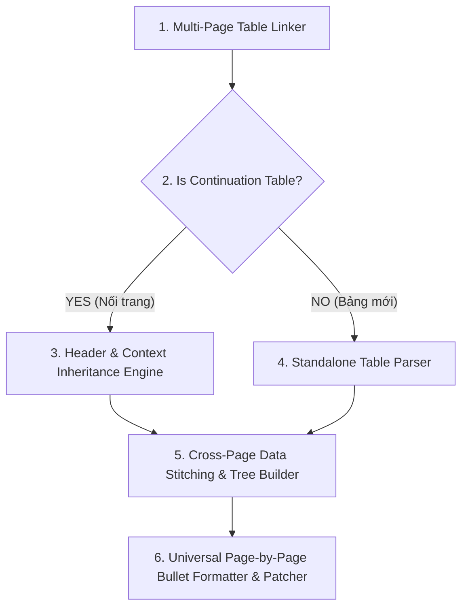

# Báo Cáo Kiến Trúc Xử Lý Bảng Liên Trang (Multi-Page Table Stitching & Context Propagation Engine 3.0)

> **Tài liệu hướng dẫn xử lý:** `solution3.md`  
> **Dự án:** `pdf-table-flattener`  
> **Ngày cập nhật:** 01/08/2026  
> **Mục tiêu:** Xử lý triệt để các bảng PDF kéo dài qua nhiều trang (Multi-page Tables). Tự động nhận diện tính liên tục giữa các trang, ghép nối tiêu đề (Header Inheritance) và kế thừa ngữ cảnh hàng (Row Context Propagation), **tránh việc xử lý độc lập từng trang gây hỏng tiêu đề và lặp text sai ở các trang nối tiếp**.

---

## I. NGUYÊN NHÂN GỐC RỄ LỖI HỎNG TRANG NỐI TIẾP (PAGE 2 FAILURES)

1. **Xử lý độc lập từng trang (Isolated Page-by-Page Extraction):**
   * Hiện tại, hệ thống chạy `detect_tables_by_page` và `router.route_and_extract` tách biệt trên từng trang độc lập.
   * Trên Trang 1: Bảng có Tiêu đề `Khoản | Điều kiện | Quy định` và Hàng `3.1 | Điều kiện vay vốn | ...`.
   * Trên Trang 2: Bảng nối tiếp ở đầu trang **không có dòng tiêu đề cột** và Cột 0/1 bị bỏ trống (vì gộp dọc từ Trang 1).
   * **Hậu quả:** `RuleExtractor` trên Trang 2 không thấy tiêu đề nên tự động coi dòng đầu tiên trên Trang 2 (chứa text `+ Căn cước công dân gắn chip...`) là **Header của Cột 0**! Dẫn tới `formatter.py` tự động ghép `+ Căn cước công dân...` làm prefix cho TẤT CẢ các dòng bên dưới ở Trang 2.

2. **Thiếu tính năng Kế thừa Tiêu đề & Ngữ cảnh Liên trang (Multi-Page Context Propagation):**
   * Trang 2 cần biết nó là **nội dung nối tiếp của Trang 1**.
   * Trang 2 phải **kế thừa Tiêu đề cột** `["Khoản", "Điều kiện", "Quy định"]` từ Trang 1.
   * Trang 2 phải **kế thừa Ngữ cảnh hàng** (`3.1 - Điều kiện vay vốn`) từ Trang 1 nếu Cột 0/1 ở Trang 2 bị rỗng.

3. **Lỗi coi văn bản dạng Bullet (`+ `, `- `) làm Tiêu đề:**
   * Trong `formatter.py`, nếu một ô chứa văn bản bắt đầu bằng dấu cộng `+ ` hoặc gạch đầu dòng `- `, đó là nội dung danh sách, **tuyệt đối không bao giờ được coi làm Header Prefix** cho các ô khác.

---

## II. KIẾN TRÚC XỬ LÝ BẢNG LIÊN TRANG (MULTI-PAGE TABLE STITCHING ENGINE)



### 1. Thuật toán Nhận diện Bảng Liên Trang (Multi-Page Continuation Detection)
Bảng $T_{N+1}$ trên Trang $N+1$ được xác định là **bảng nối tiếp** của Bảng $T_N$ trên Trang $N$ khi thỏa mãn đồng thời các điều kiện hình học & cấu trúc tổng quát:
1. **Vị trí hình học (Spatial Proximity):**
   * $T_N$ nằm ở cuối Trang $N$ ($y_1 > \text{PageHeight} \times 0.60$).
   * $T_{N+1}$ nằm ở đầu Trang $N+1$ ($y_0 < \text{PageHeight} \times 0.40$).
2. **Đồng dạng Cột (Column Alignment Match):**
   * Tọa độ chiều ngang $x_0, x_1$ của $T_N$ và $T_{N+1}$ trùng khớp trong khoảng dung sai $\pm 15\text{pt}$.
   * Số lượng cột $C_N \approx C_{N+1}$.
3. **Thiếu Tiêu đề Độc lập (Missing Independent Header):**
   * Hàng đầu tiên của $T_{N+1}$ chứa dữ liệu liệt kê hoặc ô trống, không phải là hàng tiêu đề chung.

---

### 2. Mô hình Kế thừa Tiêu đề & Ngữ cảnh (Header & Row Context Inheritance)

Khi $T_{N+1}$ là bảng nối tiếp:
* **Kế thừa Tiêu đề (Header Inheritance):**
  $$\text{Headers}(T_{N+1}) = \text{Headers}(T_N) = [\text{"Khoản"}, \text{"Điều kiện"}, \text{"Quy định"}]$$
* **Kế thừa Hàng dở dang (Unfinished Row Propagation):**
  * Nếu hàng đầu tiên trên Trang $N+1$ có Cột 0 và Cột 1 bị trống (do gộp ô từ Trang $N$), kế thừa trực tiếp nhãn hàng từ dòng cuối của Trang $N$:
    $$\text{RowContext}(T_{N+1}, \text{Row 0}) = (\text{"3.1"}, \text{"Điều kiện vay vốn"})$$

---

### 3. Quy tắc Formatter Chống Coi Bullet làm Header (`formatter.py`)

Trong `formatter.py`, bổ sung bộ lọc quy tắc tổng quát:
```python
def _should_skip_header(header: str, val: str, col_idx: int = -1) -> bool:
    h_clean = header.strip()
    # Nếu header bắt đầu bằng dấu danh sách bullet (+ hoặc -), KHÔNG ĐƯỢC DÙNG LÀM HEADER
    if re.match(r"^[\+\-\*\•]\s", h_clean):
        return True
    ...
```

---

## III. LỘ TRÌNH THỰC THI (EXECUTION PLAN)

1. **Cập nhật [`table_detector.py`](file:///c:/Users/ADMIN/OneDrive/M%C3%A1y%20t%C3%ADnh/pdf-table-flattener/src/pdf_table_tool/table_detector.py):**
   * Thêm hàm `link_multipage_tables(pages_with_tables)` để ghép nối danh sách các bảng liên trang thành các cụm `MultiPageTableCluster`.
2. **Cập nhật [`pipeline.py`](file:///c:/Users/ADMIN/OneDrive/M%C3%A1y%20t%C3%ADnh/pdf-table-flattener/src/pdf_table_tool/pipeline.py):**
   * Truyền thông tin Tiêu đề (`headers`) và Ngữ cảnh hàng (`row_context`) từ Trang $N$ sang Trang $N+1$ khi xử lý bảng liên trang.
3. **Cập nhật [`formatter.py`](file:///c:/Users/ADMIN/OneDrive/M%C3%A1y%20t%C3%ADnh/pdf-table-flattener/src/pdf_table_tool/formatter.py):**
   * Ngăn chặn tuyệt đối việc sử dụng chuỗi có chứa dấu bullet `+ ` hay `- ` làm tiêu đề tiền tố.
4. **Kiểm thử & Xác minh:**
   * Chạy lại trên file `Sản phẩm cho vay kinh doanh xi măng Xuân Thành - Kênh quầy.docx.pdf` và file LPBank để đảm bảo Trang 2 không còn bị dồn chữ `+ Căn cước công dân...` vào mọi dòng.

---
*Tài liệu được tự động cập nhật bởi Antigravity AI Assistant.*
