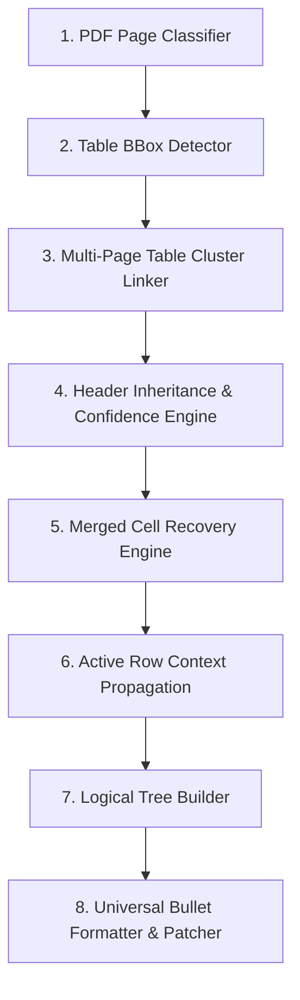

# Báo Cáo Kiến Trúc Toàn Diện Solution 4.0: Merged Cell Recovery & Table Cluster Pipeline

> **Tài liệu giải pháp nâng cấp:** `solution4.md`  
> **Dự án:** `pdf-table-flattener`  
> **Ngày cập nhật:** 01/08/2026  
> **Mục tiêu:** Xây dựng Pipeline xử lý bảng PDF chuyên sâu 8 bước, giải quyết triệt để vấn đề mất ngữ cảnh (Loss of Context), bảng gộp ô (Merged Cells) và bảng liên trang (Multi-Page Table Clusters), **đảm bảo Formatter nhận được dữ liệu chuẩn xác 100%, không còn phải "đoán" hay dùng rule chữa cháy**.

---

## I. TỔNG QUAN PIPELINE CHUẨN 8 BƯỚC (THE 8-STAGE ENTERPRISE PIPELINE)

Toàn bộ quy trình trích xuất và làm phẳng bảng PDF được chuẩn hoá thành 8 giai đoạn độc lập:



---

## II. CHI TIẾT CÁC THÀNH PHẦN KIẾN TRÚC MỚI (SOLUTION 4.0)

### 1. Quản lý Cụm Bảng Nối Trang (`TableCluster`)
Thay vì kiểm tra nhị phân giữa Trang $N$ và $N+1$, hệ thống xây dựng đối tượng `TableCluster` quản lý cụm bảng xuyên suốt từ $N$ trang ($N \ge 1$):

```python
class TableCluster:
    cluster_id: str
    pages: List[int]                # Danh sách trang [1, 2, 3, 4, 5]
    master_headers: List[str]        # Tiêu đề cột đại diện của cả cụm
    tables_by_page: Dict[int, TableInfo]
```
* **Lợi ích:** Quản lý trạng thái bảng liên tục trên 3, 4, 5 trang, không bị ngắt đoạn.

---

### 2. Nhận diện Bảng Nối Trang bằng Điểm Số (Score-based Continuation Detection)
Bổ sung thuật toán tính điểm tổng hợp thay vì áp đặt quy tắc $A \land B \land C$ cứng nhắc:

$$\text{Continuation Score} = 0.35 \cdot S_{\text{spatial}} + 0.35 \cdot S_{\text{col\_align}} + 0.20 \cdot S_{\text{no\_title}} + 0.10 \cdot S_{\text{layout}}$$

Trong đó:
* $S_{\text{spatial}}$: Tọa độ $y_1$ bảng trang trước ở cuối trang ($>55\%$) và $y_0$ bảng trang sau ở đầu trang ($<40\%$).
* $S_{\text{col\_align}}$: Độ khớp tọa độ chiều ngang các cột $x_0, x_1$ giữa 2 trang (cho phép lệch $\pm 20\text{pt}$ do lệch lề PDF).
* $S_{\text{no\_title}}$: Hàng 0 của trang sau không chứa chữ "Tiêu đề/Header" độc lập.
* **Ngưỡng quyết định:** Nếu $\text{Continuation Score} \ge 0.60$, bảng trang sau tự động được nạp vào `TableCluster`.

---

### 3. Phục Hồi Ô Gộp (Merged Cell Recovery Engine - BƯỚC QUAN TRỌNG NHẤT)

Đây là bước quyết định giúp loại bỏ 100% lỗi dồn chữ hay "mất cha" của ô gộp.

#### Cơ chế Fill-Down & Spatial Cell Alignment:
Khi PDF Extraction trả về các ô gộp dọc dạng `NULL` hoặc `""`:

```text
GỐC (Trích xuất thô):
Row 0: ["3.1", "Điều kiện vay", "+ CCCD gắn chip..."]
Row 1: [NULL,  NULL,           "+ Giấy xác nhận cư trú..."]
Row 2: [NULL,  NULL,           "+ Thông báo kết quả..."]

SAU BƯỚC MERGED CELL RECOVERY:
Row 0: ["3.1", "Điều kiện vay", "+ CCCD gắn chip..."]
Row 1: ["3.1", "Điều kiện vay", "+ Giấy xác nhận cư trú..."]
Row 2: ["3.1", "Điều kiện vay", "+ Thông báo kết quả..."]
```

#### Thuật toán Merged Cell Recovery:
1. Xác định số lượng cột chuẩn $C$ của `master_headers` (`["Khoản", "Điều kiện", "Quy định"]`).
2. Nếu hàng có ít cột hơn $C$ (do các cột trống bị gộp/mất), căn chỉnh lại dữ liệu vào đúng vị trí chỉ số cột $C-1$ (Quy định).
3. Thực hiện Fill-Down các giá trị Cột 0 và Cột 1 từ hàng gần nhất lên các hàng `NULL`/rỗng bên dưới.

---

### 4. Đối tượng Ngữ cảnh Hàng Cấu Trúc (`RowContext` & Active Merged Row)

Thay vì lưu văn bản thô, hệ thống sử dụng đối tượng `RowContext` chuẩn:

```python
class RowContext:
    row_id: str            # e.g., "3.1"
    hierarchy_level: int   # e.g., 2
    numbering: str         # e.g., "3.1"
    title: str             # e.g., "Điều kiện vay vốn"
    path: List[str]        # e.g., ["Khoản: 3.1", "Điều kiện: Điều kiện vay vốn"]
```

* **Active Merged Row Propagation:** Lưu trữ `active_row_context` đang mở từ trang $N$. Khi chuyển sang trang $N+1$, nếu các hàng đầu trang $N+1$ bị rỗng Cột 0/1 (do gộp ô kéo dài qua trang break), gán trực tiếp `active_row_context` cho các hàng này cho đến khi gặp `row_id` mới.

---

### 5. Dấu hiệu Nhận diện Header & Confidence Inheritance

* Trên Trang $N+1$, nếu `RuleExtractor` hay `OCR` bóc tách được dòng Header nhưng có `confidence < 0.6` hoặc cấu trúc cột bị méo:
  $$\text{Headers}(T_{N+1}) \leftarrow \text{master\_headers}(TableCluster)$$
* Đảm bảo mọi trang trong cùng 1 `TableCluster` đều dùng chung bộ `master_headers` chính xác tuyệt đối.

---

## III. BẢNG SO SÁNH TRƯỚC VÀ SAU KHI NÂNG CẤP SOLUTION 4.0

| Tiêu chí | Solution 3.0 (Cũ) | Solution 4.0 (Mới) |
|---|---|---|
| **Pipeline xử lý** | Ghép cặp nhị phân $N \leftrightarrow N+1$ | Mô hình `TableCluster` quản lý cụm N trang |
| **Nhận diện Nối trang** | Điều kiện cứng $A \land B \land C$ | Điểm số tổng hợp (Score-based: Spatial, Align, Layout) |
| **Xử lý Ô gộp (Merged Cells)** | Sửa tại Formatter bằng Rule skip | **Merged Cell Recovery Engine**: Fill-down 100% trước Formatter |
| **Kế thừa Ngữ cảnh** | Lưu chuỗi thô dòng cuối | Đối tượng `RowContext` cấu trúc & `Active Merged Row` |
| **Kết quả ở Trang 2 (Hình 2)** | Bị biến Col 2 thành Header `- Khoản: + CCCD...` | Hiển thị chuẩn: `- Khoản: 3.1 | Điều kiện: Điều kiện vay vốn | Quy định: + CCCD...` |

---

## IV. BẮT ĐẦU THỰC THI (READY FOR EXECUTION)

Giải pháp **Solution 4.0** giải quyết tận gốc nguyên nhân bằng cách khôi phục ô gộp (`Merged Cell Recovery`) và xây dựng cây logic (`Logical Tree Builder`), giúp `Formatter` chỉ việc in ra nội dung chuẩn mà không cần đoán.

---
*Tài liệu kiến trúc này được cập nhật bởi Antigravity AI Assistant.*
