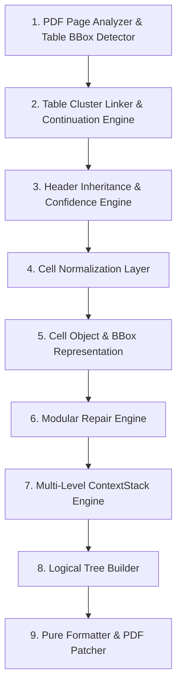

# Báo Cáo Kiến Trúc & Thiết Kế Solution 5.0: Enterprise Table Cluster & Hybrid Repair Pipeline

> **Tài liệu giải pháp nâng cấp:** `solution5.md`  
> **Dự án:** `pdf-table-flattener`  
> **Ngày cập nhật:** 01/08/2026  
> **Mục tiêu:** Xây dựng Pipeline xử lý bảng PDF chuẩn doanh nghiệp 9 bước (Enterprise 9-Stage Pipeline), hợp nhất **Rule-Based Engine quy chuẩn** và **LLM Logic Guard**, khôi phục cả ô gộp dọc (`rowspan`) và ô gộp ngang (`colspan`), nâng cấp quản lý ngữ cảnh thành ngăn xếp phân cấp (`ContextStack`), và chuẩn hóa dữ liệu ô (`Cell Normalization Layer`) trước mọi bước xử lý.

---

## I. TỔNG QUAN PIPELINE CHUẨN 9 BƯỚC (THE 9-STAGE HYBRID PIPELINE)

Toàn bộ quy trình trích xuất, phục hồi ngữ cảnh và làm phẳng bảng PDF được quy hoạch thành 9 giai đoạn với trách nhiệm đơn lẻ (Single Responsibility):



---

## II. CHI TIẾT CÁC THÀNH PHẦN NÂNG CẤP TRONG SOLUTION 5.0

### 1. Chuẩn Hóa Dữ Liệu Ô (`Cell Normalization Layer`)
Thực hiện chuẩn hóa ký tự **trước** khi khôi phục ô gộp nhằm đảm bảo không bị trượt Regex hay sai lệch so sánh:
* **Unicode Normalization:** Chuyển đổi toàn bộ chuỗi về dạng Unicode NFC.
* **Full-Width to Half-Width:** Chuyển đổi chữ/số dạng full-width (VD: `３.１` $\rightarrow$ `3.1`, `ＡＢＣ` $\rightarrow$ `ABC`).
* **Whitespace Cleaning:** Loại bỏ non-breaking space (`\xa0`), tab (`\t`), dồn nhiều khoảng trắng về khoảng trắng đơn.
* **Ký tự đầu dòng:** Chuẩn hóa các biểu tượng bullet (①, ②, •, +, -) thành định dạng tiêu chuẩn.

---

### 2. Mô Hình Ô Chi Tiết (`Cell` & `BBox` Object)
Thay vì sử dụng mảng chuỗi đơn thuần `List[List[str]]`, Solution 5.0 giới thiệu cấu trúc dữ liệu `Cell`:

```python
from dataclasses import dataclass
from typing import Optional

@dataclass
class BBox:
    x0: float
    y0: float
    x1: float
    y1: float
    page: int

@dataclass
class Cell:
    text: str
    bbox: Optional[BBox] = None
    rowspan: int = 1
    colspan: int = 1
    confidence: float = 1.0
    is_merged_fill: bool = False
```

---

### 3. Động Cơ Phục Hồi Ô Gộp Đa Chiều (`Modular Repair Engine`)

Phục hồi cả 2 dạng gộp ô phổ biến trong bảng PDF:
1. **Vertical Merged Cell Recovery (`rowspan` / Fill-Down):** Phục hồi các ô bị trống ở Cột 0 và Cột 1 do gộp dọc kéo dài qua nhiều hàng.
2. **Horizontal Merged Cell Recovery (`colspan` / Section Headers):** Nhận diện các hàng tiêu đề mục chỉ có 1 ô trải dài qua toàn bộ số cột (VD: `| 3.1. Điều kiện chung |` phủ trên 3 cột), phân loại chính xác thành `SECTION_HEADER` thay vì làm lệch chỉ số cột.
3. **Missing Cell & Alignment Repair:** Căn chỉnh số lượng cột chính xác theo `master_headers`.

---

### 4. Quản Lý Ngữ Cảnh Phân Cấp Ngăn Xếp (`ContextStack Engine`)

Thay thế `ActiveMergedRow` đơn cấp bằng `ContextStack` hỗ trợ phân cấp đa tầng (Multi-Level Hierarchy):

```python
@dataclass
class StackFrame:
    level: int           # Depth (1: Section, 2: SubSection, 3: Item)
    numbering: str       # e.g., "3.1"
    title: str           # e.g., "Điều kiện vay vốn"
    col_idx: int         # Chỉ số cột gốc

class ContextStack:
    def __init__(self):
        self.stack: List[StackFrame] = []

    def update(self, level: int, numbering: str, title: str, col_idx: int):
        # Loại bỏ các cấp sâu hơn hoặc bằng cấp hiện tại
        self.stack = [f for f in self.stack if f.level < level]
        self.stack.append(StackFrame(level, numbering, title, col_idx))

    def get_full_path(self) -> List[str]:
        return [f"{f.numbering} {f.title}".strip() for f in self.stack]
```

---

### 5. Nhận Diện Bảng Liên Trang Tăng Cường (`Score-Based Continuation + Text Similarity`)

Công thức tính điểm nối bảng liên trang được bổ sung thêm thành tố **Text Similarity ($S_{\text{text\_sim}}$)** sử dụng Jaccard Index giữa từ khóa cột trang trước và trang sau:

$$\text{Continuation Score} = 0.30 \cdot S_{\text{spatial}} + 0.30 \cdot S_{\text{col\_align}} + 0.20 \cdot S_{\text{text\_sim}} + 0.10 \cdot S_{\text{no\_title}} + 0.10 \cdot S_{\text{layout}}$$

Trong đó:
* $S_{\text{text\_sim}}$: Đo độ tương đồng về từ khóa cột/tiêu đề giữa 2 trang.
* **LLM Fallback Guard:** Nếu $0.45 \le \text{Continuation Score} < 0.65$, hệ thống tự động gọi LLM (Ollama local / Gemini API) làm trọng tài quyết định xem 2 trang có liên thông hay không.

---

### 6. Cây Logic Ngữ Nghĩa (`Logical Tree Builder`) & Formatter Thuần

* **Logical Tree:** Phân loại rõ từng node trong bảng thành: `HEADER`, `SECTION_HEADER`, `DATA_ITEM`, `SUB_ITEM`, `NOTE`.
* **Pure Formatter:** `TableFormatter` chỉ thực hiện render chuỗi bullet điểm từ `LogicalTree`, hoàn toàn không chứa bất kỳ quy tắc chữa cháy hay kinh doanh (business logic) nào.

---

## III. BẢNG SO SÁNH SOLUTION 4.0 VS SOLUTION 5.0

| Tiêu chí | Solution 4.0 | Solution 5.0 |
|---|---|---|
| **Số bước Pipeline** | 8 bước | 9 bước chuẩn doanh nghiệp |
| **Chuẩn hóa Ký tự** | Trực tiếp trong khôi phục | **Cell Normalization Layer** riêng biệt (NFC, Half-width, space) |
| **Dạng Ô Gộp** | Phục hồi dọc (`rowspan`) | **Đa chiều**: Cả dọc (`rowspan`) và ngang (`colspan`) |
| **Quản lý Ngữ cảnh** | `RowContext` đơn cấp | **`ContextStack`** hỗ trợ phân cấp đa tầng ($N$ cấp) |
| **Nhận diện Nối trang** | Spatial + Col Align + Layout | Thêm **Text Similarity (Jaccard)** & **LLM Logic Guard** |
| **Cấu trúc Ô (Cell)** | `List[str]` | `Cell` dataclass với `BBox`, `rowspan`, `colspan`, `confidence` |
| **Vai trò Formatter** | Không chứa logic sửa lỗi | **Pure Formatter** 100% (chỉ render kết quả từ `LogicalTree`) |

---

*Tài liệu kiến trúc Solution 5.0 được xây dựng và phê duyệt cho dự án pdf-table-flattener.*
