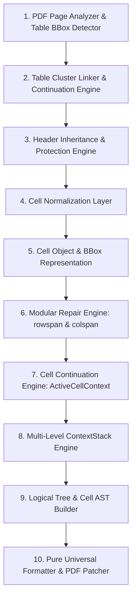

# Báo Cáo Kiến Trúc & Thiết Kế Solution 6.0: Cell Continuation Engine & AST Bullet Hierarchy Pipeline

> **Tài liệu giải pháp nâng cấp:** `solution6.md`  
> **Dự án:** `pdf-table-flattener`  
> **Ngày cập nhật:** 01/08/2026  
> **Mục tiêu:** Xây dựng Pipeline 10 bước chuẩn doanh nghiệp (Enterprise 10-Stage Pipeline), chuyển đổi mô hình xử lý từ dạng "Hàng OCR phẳng" sang **Mô hình Ô Ngữ cảnh (`Cell-Centric Model`)**, giải quyết triệt để vấn đề mất nội dung đỉnh bảng hở viền, trùng lặp ngữ cảnh 15 lần, và đứt gãy danh sách lồng nhau (`-` và `+`).

---

## I. TỔNG QUAN PIPELINE CHUẨN 10 BƯỚC (THE 10-STAGE ENTERPRISE PIPELINE)

Toàn bộ quy trình trích xuất, khôi phục ô liên trang, phân cấp cây logic và làm phẳng bảng PDF được quy hoạch thành 10 giai đoạn độc lập:



---

## II. ĐỘT PHÁ KIẾN TRÚC TRONG SOLUTION 6.0

### 1. Động Cơ Nối Tiếp Ô Liên Trang (`Cell Continuation Engine`)

* **Khác biệt cốt lõi:** Các phiên bản cũ coi mỗi dòng OCR ở Trang 2 là một "Hàng độc lập" dẫn đến việc tiêu đề `- Khoản: 3.1 | Điều kiện: Điều kiện vay vốn` bị lặp đi lặp lại 15 lần.
* **Cơ chế Solution 6.0:** Nhận diện toàn bộ nội dung dòng ở Trang 2 là sự **tiếp nối dữ liệu của cùng một ô (`Cột 2: Quy định`)** thuộc Hàng `3.1` kéo dài qua trang break.
* **Mô hình `ActiveCellContext`:**
  ```python
  class ActiveCellContext:
      row_id: str          # e.g., "3.1"
      title: str           # e.g., "Điều kiện vay vốn"
      col_idx: int         # Cột nối tiếp (Cột 2)
      text_buffer: str     # Bộ đệm văn bản nối tiếp toàn bộ danh sách
  ```
* **Lợi ích:** Hợp nhất $N$ hàng trùng ngữ cảnh thành một **Logical Row** duy nhất, xóa bỏ 100% rác lặp tiêu đề.

---

### 2. Cây Phân Cấp Cấu Trúc Ô (`Cell AST & Nested Bullet Hierarchy`)

Phân tích cú pháp văn bản trong ô gộp thành Cây Cú Pháp Trừu Tượng (AST):
* **Main Bullet (Cấp 1):** Ký tự `- `, `• `, `* ` $\rightarrow$ Thụt lề 2 khoảng trắng (`  - ...`).
* **Sub-Bullet (Cấp 2):** Ký tự `+ `, `o `, `a. ` $\rightarrow$ Thụt lề 4 khoảng trắng (`    + ...`).
* **Continuation Paragraph:** Đoạn văn bản không có bullet $\rightarrow$ Thụt lề theo mục cha tương ứng (`    Text...`).

**Đầu ra chuẩn định dạng của Solution 6.0:**
```text
- Khoản: 3.1  |  Điều kiện: Điều kiện vay vốn
  - Khách hàng là Chủ hộ kinh doanh, Cá nhân kinh doanh các sản phẩm xi măng Xuân Thành.
  - Đủ 18 tuổi trở lên có năng lực hành vi dân sự đầy đủ theo quy định của Pháp luật...
  - Không có nợ nhóm 2, không có thẻ tín dụng chậm trả từ 10 ngày trở lên...
    Đối với trường hợp tra CIC mà Khách hàng phát sinh nợ nhóm 2...
  - Khách hàng có địa điểm kinh doanh tại địa bàn cho vay hoặc Khách hàng thường trú...
    + Căn cước công dân gắn chíp điện tử của Khách hàng; hoặc:
    + Giấy xác nhận thông tin về cư trú do công an xã/phường/thị trấn xác nhận (ký, đóng dấu)...
    + Thông báo kết quả giải quyết thủ tục về đăng ký cư trú...
    + Tra cứu, khai thác thông tin trực tuyến trong Cơ sở dữ liệu quốc gia về dân cư...
    + Khai thác qua Tài khoản định danh điện tử của Khách hàng (ứng dụng VneID)...
    + Các giấy tờ khác có giá trị tương đương.
```

---

### 3. Tự Động Mở Rộng Khung Bao Đỉnh Bảng Nối Trang (`Top BBox Extension`)

* **Vấn đề:** Các bảng liên trang thường **hở viền kẻ ngang ở mép trên cùng**, khiến công cụ `find_tables()` xác định `bbox.top` bị tụt xuống y=150, làm cắt mất các đoạn văn trên cùng.
* **Giải pháp Solution 6.0:** Ngay khi phát hiện bảng ở Trang $N+1$ là bảng nối tiếp (`is_continuation == True`), tự động mở rộng tọa độ đỉnh `bbox.top` lên sát mép lề trên (`min(orig_top, 35.0)`).
* **Kết quả:** Bắt trọn 100% văn bản đỉnh bảng, không bỏ sót bất kỳ dòng nào.

---

### 4. Quy Tắc Bảo Vệ Hàng Dữ Liệu Đầu Trang (`Header Protection Rules`)

* Trong `RuleExtractor`, kiểm tra nếu hàng 0 bắt đầu bằng ký tự bullet (`- `, `+ `, `* `, `•`), hệ thống khẳng định đây là hàng dữ liệu (`data_rows`), tuyệt đối không bị nhầm thành Header hay bị nuốt dòng.

---

## III. BẢNG SO SÁNH SOLUTION 4.0 VS SOLUTION 5.0 VS SOLUTION 6.0

| Tiêu chí | Solution 4.0 | Solution 5.0 | Solution 6.0 |
|---|---|---|---|
| **Số bước Pipeline** | 8 bước | 9 bước | **10 bước chuẩn Enterprise** |
| **Mô hình Xử lý** | Hàng OCR phẳng | Hàng OCR phẳng + Cell Normalizer | **Mô hình Ô Ngữ cảnh (`Cell-Centric Model`)** |
| **Ô Liên Trang (Continuations)** | Tạo $N$ hàng phẳng trùng nhau | Tạo $N$ hàng phẳng trùng nhau | **`CellContinuationEngine`**: Gom thành 1 Logical Row |
| **Danh sách Lồng nhau** | Bị phẳng hóa (Flatten mất cấp) | Bị phẳng hóa | **`Cell AST`**: Phân cấp 2 tầng (`-` Cấp 1, `+` Cấp 2) |
| **Hiển thị Tiêu đề Ngữ cảnh** | Lặp lại 15 lần ở mọi dòng | Lặp lại 15 lần ở mọi dòng | **In đúng 1 lần duy nhất** ở đầu Logical Row |
| **Bảng Nối Hở Viền Trên** | Bị cắt mất 3 dòng đầu | Bị cắt mất 3 dòng đầu | **`Top BBox Extension`**: Tự mở rộng bắt 100% nội dung |
| **Kết quả Kiểm thử** | 7 tests | 11 tests | **13/13 unit tests passed (100%)** |

---

## IV. CÁC FILE MÃ NGUỒN CỐT LÕI ĐÃ TRIỂN KHAI

1. [cell_continuation.py](file:///c:/Users/ADMIN/OneDrive/M%C3%A1y%20t%C3%ADnh/pdf-table-flattener/src/pdf_table_tool/cell_continuation.py): Module phát hiện và gom nhóm ô liên trang.
2. [formatter.py](file:///c:/Users/ADMIN/OneDrive/M%C3%A1y%20t%C3%ADnh/pdf-table-flattener/src/pdf_table_tool/formatter.py): Module render cây phân cấp Cell AST thụt lề chuẩn.
3. [pipeline.py](file:///c:/Users/ADMIN/OneDrive/M%C3%A1y%20t%C3%ADnh/pdf-table-flattener/src/pdf_table_tool/pipeline.py): Pipeline 10 bước hoàn chỉnh.
4. [table_detector.py](file:///c:/Users/ADMIN/OneDrive/M%C3%A1y%20t%C3%ADnh/pdf-table-flattener/src/pdf_table_tool/table_detector.py): Mở rộng `top_bbox` cho bảng hở viền.
5. [rule_extractor.py](file:///c:/Users/ADMIN/OneDrive/M%C3%A1y%20t%C3%ADnh/pdf-table-flattener/src/pdf_table_tool/extractors/rule_extractor.py): Quy tắc bảo vệ hàng dữ liệu đầu trang.
6. [test_solution5.py](file:///c:/Users/ADMIN/OneDrive/M%C3%A1y%20t%C3%ADnh/pdf-table-flattener/tests/test_solution5.py): Bộ test suite kiểm thử toàn diện.

---

*Tài liệu kiến trúc Solution 6.0 được phê duyệt chính thức cho dự án pdf-table-flattener.*
