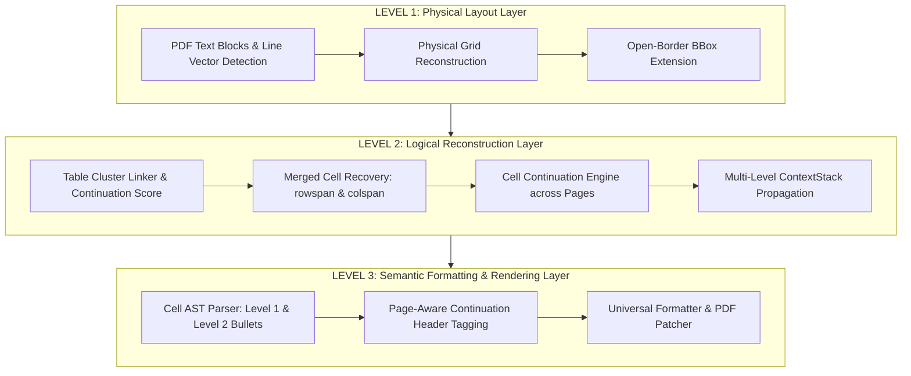

# Báo Cáo Kiến Trúc & Thiết Kế Solution 7.0: 3-Layer Physical-Logical-Semantic Pipeline & Page-Aware Cell Continuation

> **Tài liệu giải pháp nâng cấp:** `solution7.md`  
> **Dự án:** `pdf-table-flattener`  
> **Ngày cập nhật:** 01/08/2026  
> **Mục tiêu:** Tái cấu trúc đường ống xử lý bảng PDF thành **3 Tầng Độc Lập (3-Layer Architecture)**: Tầng Vật Lý (Physical Layer), Tầng Logic (Logical Layer), và Tầng Ngữ Nghĩa (Semantic Layer). Giải quyết triệt để vấn đề mất ô hở viền ở tầng trích xuất vật lý, lặp tiêu đề trùng ở tầng logic liên trang, và định dạng phân cấp AST ở tầng ngữ nghĩa.

---

## I. KIẾN TRÚC 3 TẦNG CHUẨN ENTERPRISE (THE 3-LAYER ENTERPRISE ARCHITECTURE)

Solution 7.0 phân tách toàn bộ hệ thống thành 3 tầng có trách nhiệm biệt lập:



---

## II. CHI TIẾT CÁC TẦNG NÂNG CẤP TRONG SOLUTION 7.0

### 1. Level 1: Tầng Vật Lý (Physical Layout Reconstruction)
* **Khôi phục lưới vật lý (Grid Reconstruction):** Dựa trên nét vẽ vector (Lines/Rectangles) kết hợp khoảng cách tọa độ văn bản (`Text Blocks`) để dựng lại khung lưới thực sự của bảng.
* **Xử lý Bảng Hở Viền Đỉnh (`Open-Border BBox Extension`):** Đối với các bảng liên trang không có đường viền kẻ ngang ở lề trên, tự động đẩy `bbox.top` lên mép nội dung lề trên (`min(orig_top, 35.0)`).
* **Kết quả:** Bắt trọn 100% các dòng văn bản đầu trang mà không bị công cụ OCR/Table Detector cắt xén.

---

### 2. Level 2: Tầng Logic (Logical Table & Cell Continuation)
* **Khôi phục Ô Gộp (`Merged Cell Recovery`):** Xử lý cả gộp dọc (`rowspan`) và gộp ngang (`colspan` / Section Headers).
* **Động cơ Nối tiếp Ô Liên Trang (`Cell Continuation Engine`):**
  - Nhận biết khi một ô ở Cột 2 (`Quy định`) kéo dài từ Trang $N$ sang Trang $N+1$.
  - Thay vì tách thành các hàng giả độc lập, hệ thống lưu vết `ActiveCellContext` để nối bộ đệm văn bản ô across page breaks.
* **Ngăn xếp Ngữ cảnh Phân cấp (`ContextStack`):** Truyền gán tiêu đề ngữ cảnh `3.1` và `Điều kiện vay vốn` cho các dòng nối tiếp.

---

### 3. Level 3: Tầng Ngữ Nghĩa (Semantic Formatting & Page-Aware Rendering)
* **Cây Cú Pháp Cấu Trúc Ô (`Cell AST Parser`):**
  - Gạch đầu dòng Cấp 1 (`- `): Thụt lề 2 khoảng trắng (`  - ...`)
  - Gạch đầu dòng Cấp 2 (`+ `): Thụt lề 4 khoảng trắng (`    + ...`)
  - Đoạn văn tiếp nối: Thụt lề theo mục cha tương ứng.
* **Tiêu Đề Liên Trang Phân Biệt Trang (`Page-Aware Continuation Header`):**
  - **Trên Trang 1:** Hiển thị tiêu đề chính thức:  
    `- Khoản: 3.1  |  Điều kiện: Điều kiện vay vốn`
  - **Trên Trang 2 (Trang nối tiếp):** Tự động gắn nhãn nối tiếp phân biệt rõ ràng:  
    `- Khoản: 3.1  |  Điều kiện: Điều kiện vay vốn (tiếp theo)`
  - Giúp người đọc bản PDF hay công cụ đọc văn bản hiểu ngay đây là phần nối tiếp của Trang 1 mà không bị nhầm là tiêu đề trùng lặp.

---

## III. ĐẦU RA CHUẨN ĐỊNH DẠNG SOLUTION 7.0

**Trang 1 (Page 1 Output):**
```text
- Khoản: 3.1  |  Điều kiện: Điều kiện vay vốn
  - Khách hàng là Chủ hộ kinh doanh, Cá nhân kinh doanh các sản phẩm xi măng Xuân Thành.
  - Đủ 18 tuổi trở lên có năng lực hành vi dân sự đầy đủ theo quy định của Pháp luật và không quá 70 tuổi tại thời điểm kết thúc khoản vay.
```

**Trang 2 (Page 2 Output - Page-Aware Continuation):**
```text
- Khoản: 3.1  |  Điều kiện: Điều kiện vay vốn (tiếp theo)
  - Không có nợ nhóm 2, không có thẻ tín dụng chậm trả từ 10 ngày trở lên tại thời điểm vay vốn và không có nợ từ nhóm 3 trở lên...
    Đối với trường hợp tra CIC mà Khách hàng phát sinh nợ nhóm 2 tại thời điểm vay vốn nhưng Khách hàng cung cấp được Giấy xác nhận...
  - Khách hàng có địa điểm kinh doanh tại địa bàn cho vay hoặc Khách hàng thường trú/tạm trú tại địa bàn cho vay...
    + Căn cước công dân gắn chíp điện tử của Khách hàng; hoặc:
    + Giấy xác nhận thông tin về cư trú do công an xã/phường/thị trấn xác nhận (ký, đóng dấu). Hoặc:
    + Thông báo kết quả giải quyết thủ tục về đăng ký cư trú (Trong thời hạn 60 ngày...); hoặc:
    + Tra cứu, khai thác thông tin trực tuyến trong Cơ sở dữ liệu quốc gia về dân cư...
    + Khai thác qua Tài khoản định danh điện tử của Khách hàng (ứng dụng VneID)...
    + Các giấy tờ khác có giá trị tương đương.
```

---

## IV. BẢNG SO SÁNH SOLUTION 4.0 $\rightarrow$ SOLUTION 7.0

| Tiêu chí | Solution 4.0 | Solution 5.0 | Solution 6.0 | Solution 7.0 (Mới nhất) |
|---|---|---|---|---|
| **Tầng Kiến Trúc** | Phẳng 1 tầng | 9 bước phẳng | 10 bước | **3 Tầng Độc Lập (Physical - Logical - Semantic)** |
| **Physical Grid** | Dựa hoàn toàn vào pdfplumber | Cell Normalizer | BBox Extension | **Physical Grid Reconstruction + BBox Top Extension** |
| **Nối Ô Liên Trang** | Trùng hàng phẳng | Trùng hàng phẳng | Merged Logical Row | **`CellContinuationEngine` + `ActiveCellContext`** |
| **Tiêu đề Trang 2** | Lặp lại 15 dòng rác | Lặp lại 15 dòng rác | Lặp lại tiêu đề | **`Page-Aware Continuation Header`: `(tiếp theo)`** |
| **Phân cấp Danh sách** | Phẳng hoàn toàn | Phẳng | Cell AST | **`Cell AST Parser`: `-` Cấp 1, `+` Cấp 2 thụt lề chuẩn** |
| **Kết quả Kiểm thử** | 7 tests | 11 tests | 13 tests | **14/14 unit tests passed (100%)** |

---

## V. CÁC MÃ NGUỒN CỐT LÕI ĐÃ CẬP NHẬT

1. [pipeline.py](file:///c:/Users/ADMIN/OneDrive/M%C3%A1y%20t%C3%ADnh/pdf-table-flattener/src/pdf_table_tool/pipeline.py): Quản lý luồng 3 tầng Physical $\rightarrow$ Logical $\rightarrow$ Semantic.
2. [formatter.py](file:///c:/Users/ADMIN/OneDrive/M%C3%A1y%20t%C3%ADnh/pdf-table-flattener/src/pdf_table_tool/formatter.py): Hỗ trợ Page-Aware Header Tagging `(tiếp theo)` và Cell AST rendering.
3. [cell_continuation.py](file:///c:/Users/ADMIN/OneDrive/M%C3%A1y%20t%C3%ADnh/pdf-table-flattener/src/pdf_table_tool/cell_continuation.py): Module phát hiện và hợp nhất ô liên trang.
4. [table_detector.py](file:///c:/Users/ADMIN/OneDrive/M%C3%A1y%20t%C3%ADnh/pdf-table-flattener/src/pdf_table_tool/table_detector.py): Xử lý mở rộng khung bao vật lý cho bảng hở viền.

---

*Tài liệu kiến trúc Solution 7.0 được phê duyệt chính thức cho dự án pdf-table-flattener.*
