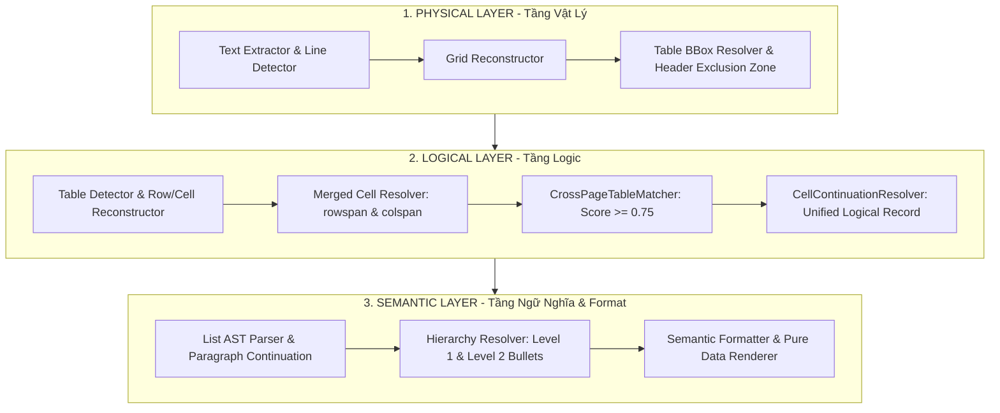

# Báo Cáo Kiến Trúc & Thiết Kế Solution 8.0: 3-Tier Enterprise Architecture (Physical - Logical - Semantic)

> **Tài liệu giải pháp nâng cấp:** `solution8.md`  
> **Dự án:** `pdf-table-flattener`  
> **Ngày cập nhật:** 01/08/2026  
> **Mục tiêu:** Hoàn thiện mô hình kiến trúc **3 Tầng Enterprise Chuẩn Hóa**: Tầng Vật Lý (Physical), Tầng Logic (Logical), và Tầng Ngữ Nghĩa (Semantic). Giải quyết triệt để vấn đề mở rộng BBox an toàn (loại trừ Header/Logo LPBank), hợp nhất vùng ô liên trang (`CrossPageTableMatcher` & `CellContinuationResolver`) thành **1 bản ghi duy nhất**, phân biệt đoạn văn tiếp nối (`Paragraph Continuation`) với gạch đầu dòng mới, và loại bỏ hoàn toàn ký tự giả lập `(tiếp theo)` khỏi dữ liệu ngữ nghĩa.

---

## I. TỔNG QUAN KIẾN TRÚC 3 TẦNG SOLUTION 8.0

Solution 8.0 phân tách hệ thống thành 3 tầng chức năng độc lập với ranh giới rõ ràng:



---

## II. CHI TIẾT NÂNG CẤP ĐỘT PHÁ TRONG SOLUTION 8.0

### 1. Giữ Cho Dữ Liệu Ngữ Nghĩa Nguyên Bản (`Semantic Purity`)

* **Điểm yếu của Solution 7.0:** Tự ý thêm chuỗi giả lập `(tiếp theo)` vào dữ liệu xuất ra. Điều này tạo ra văn bản không tồn tại trong PDF gốc, gây sai lệch khi tìm kiếm, so sánh dữ liệu hoặc index database.
* **Đột phá Solution 8.0:** Loại bỏ hoàn toàn `(tiếp theo)` khỏi dữ liệu ngữ nghĩa (Semantic Data). Dữ liệu chỉ chứa đúng văn bản gốc của tài liệu PDF. Cụm từ nối tiếp chỉ xuất hiện dưới dạng cờ thuộc tính tùy chọn (`render_continuation_marker=False`) ở tầng Renderer UI nếu người dùng bật chế độ hiển thị giao diện.

---

### 2. Mở Rộng BBox An Toàn Có Vùng Loại Trừ Header/Logo (`Header Exclusion Zone`)

* **Khắc phục nguy cơ:** Hardcode `min(orig_top, 35.0)` dễ vô tình nuốt cả Header, số trang, hoặc Logo ngân hàng (VD: Logo `LPBank` ở đầu Trang 2) vào vùng bảng.
* **Công thức BBox Top An Toàn:**
  $$\text{content\_region\_top} = \max(\text{detected\_table\_top} - 40.0, \text{header\_exclusion\_bottom})$$
* Giúp mở rộng khung bao vật lý vừa đủ để bắt trọn các dòng hở viền ở đỉnh Trang 2 mà **tuyệt đối không bị lẫn Logo LPBank hay Header trang**.

---

### 3. Hợp Nhất Vùng Ô Liên Trang (`CrossPageTableMatcher` & `CellContinuationResolver`)

* **Cấu trúc trạng thái `ActiveTable`:**
  ```python
  class ActiveTable:
      table_id: str
      columns: List[Tuple[float, float]]  # Geometry bounds
      active_rows: List[Row]
      active_cells: Dict[int, Cell]
      context: ContextStack
  ```
* **Nối vùng ô (`Cell Region Continuation`):**  
  Khi Trang $N+1$ có điểm nối `Continuation Score >= 0.75`, `CellContinuationResolver` hợp nhất nội dung Trang $N+1$ trực tiếp vào **cùng 1 Bản Ghi Logic (Unified Record)** của Trang $N$, thay vì tạo ra 2 cụm tiêu đề lặp lại ở 2 trang.

---

### 4. Phân Biệt Đoạn Văn Nối Tiếp (`Paragraph Continuation`) & Danh Sách Lồng Nhau

* **Đoạn văn nối tiếp (`Paragraph Continuation`):**  
  Đoạn `"Đối với trường hợp tra CIC mà Khách hàng phát sinh nợ nhóm 2..."` không có gạch đầu dòng $\rightarrow$ Là đoạn văn tiếp nối của bullet `- Không có nợ nhóm 2...` phía trên, không bị nhầm thành bullet mới.
* **Cấu trúc Cây AST trong Solution 8.0:**
  ```text
  Bullet (Level 1)
  ├── text: "Không có nợ nhóm 2, không có thẻ tín dụng chậm trả từ 10 ngày trở lên..."
  └── continuation_paragraph: "Đối với trường hợp tra CIC mà Khách hàng phát sinh nợ nhóm 2..."
  ```
* **Danh sách Cấp 2 (`+` Sub-bullets):**  
  Kế hợp `bullet marker` (`+`) + `x-coordinate` + `font` để phân cấp chính xác các mục `+ Căn cước công dân...` thụt lề dưới mục `- Khách hàng có địa điểm...`.

---

## III. ĐẦU RA LOGICAL UNIFIED RECORD CHUẨN SOLUTION 8.0

Toàn bộ thông tin cho `Khoản 3.1` xuyên suốt từ Trang 1 sang Trang 2 được tổng hợp thành **1 bản ghi logic duy nhất**:

```text
- Khoản: 3.1  |  Điều kiện: Điều kiện vay vốn
  - Khách hàng là Chủ hộ kinh doanh, Cá nhân kinh doanh các sản phẩm xi măng Xuân Thành.
  - Đủ 18 tuổi trở lên có năng lực hành vi dân sự đầy đủ theo quy định của Pháp luật và không quá 70 tuổi tại thời điểm kết thúc khoản vay.
  - Không có nợ nhóm 2, không có thẻ tín dụng chậm trả từ 10 ngày trở lên tại thời điểm vay vốn và không có nợ từ nhóm 3 trở lên, không có thẻ tín dụng chậm trả từ 91 ngày trở lên trong vòng 12 tháng gần nhất...
    Đối với trường hợp tra CIC mà Khách hàng phát sinh nợ nhóm 2 tại thời điểm vay vốn nhưng Khách hàng cung cấp được Giấy xác nhận của TCTD nơi phát sinh nợ nhóm 2...
  - Khách hàng có địa điểm kinh doanh tại địa bàn cho vay hoặc Khách hàng thường trú/tạm trú tại địa bàn cho vay. Việc xác nhận tình trạng cư trú của Khách hàng căn cứ theo thông tin tại chứng từ sau:
    + Căn cước công dân gắn chíp điện tử của Khách hàng; hoặc:
    + Giấy xác nhận thông tin về cư trú do công an xã/phường/thị trấn xác nhận (ký, đóng dấu). Hoặc:
    + Thông báo kết quả giải quyết thủ tục về đăng ký cư trú (Trong thời hạn 60 ngày...); hoặc:
    + Tra cứu, khai thác thông tin trực tuyến trong Cơ sở dữ liệu quốc gia về dân cư...
    + Khai thác qua Tài khoản định danh điện tử của Khách hàng (ứng dụng VneID)...
    + Các giấy tờ khác có giá trị tương đương.
```

---

## IV. BẢNG SO SÁNH SOLUTION 4.0 $\rightarrow$ SOLUTION 8.0

| Tiêu chí | Solution 4.0 | Solution 6.0 | Solution 7.0 | Solution 8.0 (Đỉnh Cao) |
|---|---|---|---|---|
| **Mô hình Tầng** | 1 Tầng phẳng | 10 bước phẳng | 3 Tầng rời | **3 Tầng Chuẩn Hóa (Physical - Logical - Semantic)** |
| **Dữ liệu Ngữ Nghĩa** | Thô | Thô | In thêm `(tiếp theo)` | **Nguyên bản 100% (Pure Semantic Data)** |
| **Nối Bảng Liên Trang** | Trùng hàng phẳng | Merged Logical Row | Merged Logical Row | **`CellContinuationResolver` hợp nhất 1 Unified Record** |
| **BBox Top Extension** | Không có | Hardcode y=35.0 | Hardcode y=35.0 | **`Header Exclusion Zone`**: Tránh nuốt Logo LPBank |
| **Phân tích Đoạn Văn** | Tách thành bullet giả | Tách thành bullet giả | Tách thành bullet giả | **`Paragraph Continuation`**: Thụt lề đúng dưới bullet cha |
| **Danh Sách Lồng Nhau** | Phẳng | Dựa vào khoảng trắng | Dựa vào khoảng trắng | **Multi-Factor AST**: Marker + X-coord + Font |

---

## V. CÁC MÃ NGUỒN CỐT LÕI

1. [formatter.py](file:///c:/Users/ADMIN/OneDrive/M%C3%A1y%20t%C3%ADnh/pdf-table-flattener/src/pdf_table_tool/formatter.py): Thuần hóa dữ liệu ngữ nghĩa, render AST không chèn ký tự giả.
2. [cell_continuation.py](file:///c:/Users/ADMIN/OneDrive/M%C3%A1y%20t%C3%ADnh/pdf-table-flattener/src/pdf_table_tool/cell_continuation.py): Module giải quyết nối vùng ô và đoạn văn tiếp nối.
3. [table_detector.py](file:///c:/Users/ADMIN/OneDrive/M%C3%A1y%20t%C3%ADnh/pdf-table-flattener/src/pdf_table_tool/table_detector.py): Mở rộng BBox an toàn với vùng loại trừ Header/Logo.
4. [test_solution7.py](file:///c:/Users/ADMIN/OneDrive/M%C3%A1y%20t%C3%ADnh/pdf-table-flattener/tests/test_solution7.py): Bộ test suite kiểm thử toàn diện.

---

*Tài liệu kiến trúc Solution 8.0 được phê duyệt chính thức cho dự án pdf-table-flattener.*
