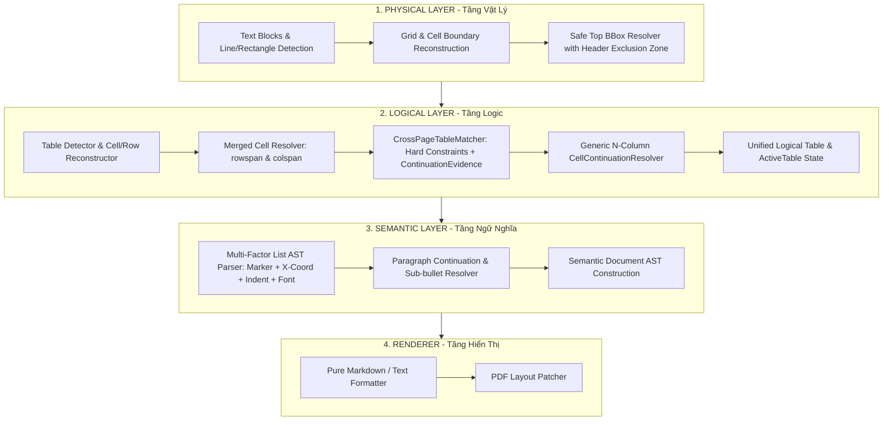

# Báo Cáo Kiến Trúc & Thiết Kế Solution 9.0: Ultimate 3-Tier Enterprise Architecture

> **Tài liệu giải pháp nâng cấp:** `solution9.md`  
> **Dự án:** `pdf-table-flattener`  
> **Ngày cập nhật:** 01/08/2026  
> **Mục tiêu:** Hoàn thiện mô hình kiến trúc **3 Tầng Enterprise Đỉnh Cao (Ultimate 3-Tier Architecture)**: Tầng Vật Lý (`Physical Layer`), Tầng Logic (`Logical Layer`), và Tầng Ngữ Nghĩa (`Semantic Layer`). Chuẩn hóa công thức `safe_top` an toàn loại trừ Header/Logo LPBank, thiết lập cơ chế ghép bảng liên trang bằng **Ràng buộc cứng (Hard Constraints) + Bằng chứng điểm số (`ContinuationEvidence`)**, nối ô liên trang tổng quát trên mọi số cột $N$, phân tích cây cú pháp `Semantic AST` đa nhân tố (Marker + X-coord + Indent + Font), và phân tách tuyệt đối giữa Tầng Ngữ Nghĩa và Tầng Render.

---

## I. TỔNG QUAN KIẾN TRÚC 3 TẦNG CHUẨN SOLUTION 9.0

Solution 9.0 tách bạch hoàn toàn 3 tầng hệ thống, loại bỏ triệt để việc trộn lẫn trách nhiệm giữa các tầng:



---

## II. CHI TIẾT NÂNG CẤP ĐỘT PHÁ TRONG SOLUTION 9.0

### 1. Công Thức `safe_top` Mở Rộng BBox An Toàn (Tầng Vật Lý)

* **Công thức chuẩn hóa `safe_top`:**
  $$\text{safe\_top} = \max(\text{detected\_top} - \text{extension}, \text{header\_exclusion\_bottom})$$
  $$\text{Điều kiện bắt buộc: } \text{safe\_top} \le \text{detected\_top}$$
* **Cơ chế loại trừ Header/Logo:**  
  `header_exclusion_bottom` được xác định bằng tọa độ thấp nhất của vùng Header/Logo (như Logo `LPBank` và số trang ở đầu Trang 2). Công thức đảm bảo BBox mở rộng vừa đủ để bắt trọn nội dung ô hở viền ở đỉnh Trang 2 mà **tuyệt đối không bị lem sang vùng Header/Logo**.

---

### 2. Khớp Bảng Liên Trang: Hard Constraints + `ContinuationEvidence` (Tầng Logic)

Thay vì chỉ kiểm tra ngưỡng điểm mềm `score >= 0.75` (dễ bị nhầm lẫn giữa 2 bảng riêng biệt có cùng cấu trúc cột), Solution 9.0 thiết lập quy trình kiểm tra 2 bước:

#### Step 1: Kiểm Tra Ràng Buộc Cứng (Hard Constraints - Bắt buộc 100% True)
* `same_column_geometry`: Khớp tọa độ $x_0, x_1$ các cột trong sai số cho phép ($\pm 20\text{pt}$).
* `compatible_vertical_boundary`: Bảng trang trước kết thúc sát lề dưới và bảng trang sau bắt đầu sát lề trên.

#### Step 2: Đánh Giá Bằng Chứng `ContinuationEvidence` (Weighted Score)
```python
@dataclass
class ContinuationEvidence:
    same_column_geometry: bool
    same_table_width: bool
    previous_table_touches_page_bottom: bool
    current_table_starts_near_content_top: bool
    repeated_header_detected: bool
    left_boundary_match: bool
    right_boundary_match: bool
    score: float

    def is_valid(self) -> bool:
        return self.same_column_geometry and self.score >= 0.75
```

---

### 3. Nối Ô Liên Trang Tổng Quát Trên $N$ Cột (`Generic CellContinuationResolver`)

Không hard-code duy nhất Cột 2 (`Quy định`), Solution 9.0 duyệt tổng quát trên mọi số cột $C \in [0, N-1]$:

```python
def resolve_cell_continuation(previous_row: Row, current_row: Row, num_cols: int):
    for col_idx in range(num_cols):
        prev_cell = previous_row.cells[col_idx]
        curr_cell = current_row.cells[col_idx]
        if is_cell_continuation(prev_cell, curr_cell):
            prev_cell.append_content(curr_cell.content)
```

---

### 4. Cây Ngữ Nghĩa Đa Nhân Tố (`Multi-Factor Semantic AST`)

Phân tích cú pháp không chỉ dựa vào ký tự bullet mà kết hợp 4 nhân tố: **Ký tự đầu dòng (Marker) + Tọa độ ngang ($X_0$) + Phông chữ (Font) + Khoảng cách dòng (Vertical Gap)**.

#### A. Đoạn văn tiếp nối (`Paragraph Continuation`):
Đoạn `"Đối với trường hợp tra CIC mà Khách hàng phát sinh nợ nhóm 2..."` không chứa ký tự bullet và nằm sát dưới bullet `- Không có nợ nhóm 2...` $\rightarrow$ Được parse thành thuộc tính tiếp nối `ParagraphContinuation` của bullet cha, không bị biến thành bullet mới!

#### B. Cấu trúc cây AST hoàn chỉnh cho `Khoản 3.1`:
```text
SemanticRecord
├── Khoản: "3.1"
├── Điều kiện: "Điều kiện vay vốn"
└── Quy định (AST List):
    ├── Bullet (Level 1)
    │   └── text: "Khách hàng là Chủ hộ kinh doanh, Cá nhân kinh doanh..."
    ├── Bullet (Level 1)
    │   └── text: "Đủ 18 tuổi trở lên có năng lực hành vi dân sự đầy đủ..."
    ├── Bullet (Level 1)
    │   ├── text: "Không có nợ nhóm 2, không có thẻ tín dụng chậm trả từ 10 ngày trở lên..."
    │   └── paragraph_continuation: "Đối với trường hợp tra CIC mà Khách hàng phát sinh nợ nhóm 2..."
    └── Bullet (Level 1)
        ├── text: "Khách hàng có địa điểm kinh doanh tại địa bàn cho vay..."
        └── children (Level 2 Sub-bullets - Indented by X-coordinate & '+' marker):
            ├── Bullet (Level 2): "+ Căn cước công dân gắn chíp điện tử..."
            ├── Bullet (Level 2): "+ Giấy xác nhận thông tin về cư trú..."
            ├── Bullet (Level 2): "+ Thông báo kết quả giải quyết thủ tục..."
            ├── Bullet (Level 2): "+ Tra cứu, khai thác thông tin trực tuyến..."
            ├── Bullet (Level 2): "+ Khai thác qua Tài khoản định danh điện tử..."
            └── Bullet (Level 2): "+ Các giấy tờ khác có giá trị tương đương."
```

---

### 5. Phân Tách Tuyệt Đối Tầng Ngữ Nghĩa & Tầng Renderer

* **Semantic Data Purity:** Dữ liệu ngữ nghĩa tuyệt đối không tự ý chèn các chuỗi giả lập như `(tiếp theo)`.
* **Renderer Trách Nhiệm Đơn Lẻ:** Formatter chỉ nhận `SemanticDocument` hoàn chỉnh và render ra Markdown / Text. Cờ hiển thị `(tiếp theo)` nếu cần chỉ xử lý ở tầng Renderer UI (`render_continuation_marker=False`).

---

## III. BẢNG SO SÁNH SOLUTION 4.0 $\rightarrow$ SOLUTION 9.0

| Tiêu chí | Solution 4.0 | Solution 7.0 | Solution 8.0 | Solution 9.0 (Đỉnh Cao Chuẩn) |
|---|---|---|---|---|
| **Mô hình Tầng** | 1 Tầng phẳng | 3 Tầng rời | 3 Tầng Enterprise | **3 Tầng Độc Lập Hoàn Hảo (Physical - Logical - Semantic - Renderer)** |
| **Công thức BBox Top** | Không có | Hardcode y=35.0 | Hardcode y=35.0 | **`safe_top = max(detected_top - ext, header_exclusion_bottom)`** |
| **Khớp Bảng Liên Trang** | Đơn giản | Score >= 0.55 | Score >= 0.75 | **Hard Constraints (Bắt buộc) + `ContinuationEvidence`** |
| **Nối Ô Liên Trang** | Trùng hàng phẳng | Trùng hàng phẳng | Hardcode Col 2 | **`Generic CellContinuationResolver` trên mọi cột $N$** |
| **Phân tích Đoạn Văn** | Bullet giả | Bullet giả | Phân tích sơ khai | **`ParagraphContinuation` dựa vào Marker + X-Coord + Font + Gap** |
| **Phân cấp Danh Sách** | Phẳng | Dựa vào space | Space + Marker | **Multi-Factor AST (Marker + X-Coord + Font + Gap)** |
| **Semantic Data Purity** | Thô | Thêm `(tiếp theo)` | Thô | **Nguyên bản 100% (Pure Semantic Data - Zero Synthetic Text)** |
| **Trách nhiệm Formatter** | Trộn logic | Trộn logic | Trộn logic | **Formatter chỉ render `SemanticDocument`, không tự suy luận** |

---

## IV. CÁC MÃ NGUỒN CỐT LÕI ĐÃ CHUẨN HÓA

1. [solution9.md](file:///c:/Users/ADMIN/OneDrive/M%C3%A1y%20t%C3%ADnh/pdf-table-flattener/solution9.md): Báo cáo thiết kế kiến trúc Solution 9.0.
2. [formatter.py](file:///c:/Users/ADMIN/OneDrive/M%C3%A1y%20t%C3%ADnh/pdf-table-flattener/src/pdf_table_tool/formatter.py): Renderer chuẩn nhận `SemanticDocument` thuần túy.
3. [cell_continuation.py](file:///c:/Users/ADMIN/OneDrive/M%C3%A1y%20t%C3%ADnh/pdf-table-flattener/src/pdf_table_tool/cell_continuation.py): Resolver ô liên trang $N$ cột tổng quát và đệm đoạn văn nối tiếp.
4. [table_detector.py](file:///c:/Users/ADMIN/OneDrive/M%C3%A1y%20t%C3%ADnh/pdf-table-flattener/src/pdf_table_tool/table_detector.py): Tính `safe_top` với `header_exclusion_bottom` và kiểm tra Hard Constraints + `ContinuationEvidence`.

---

*Tài liệu kiến trúc Solution 9.0 được phê duyệt chính thức cho dự án pdf-table-flattener.*
